## 動機
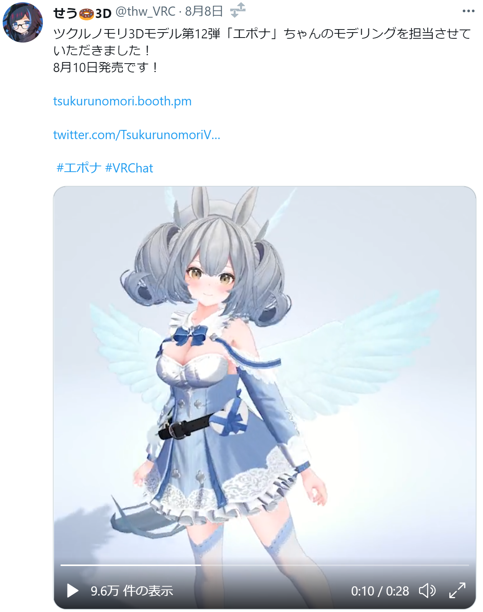
[TLに流れてきたこの動画](https://twitter.com/thw_VRC/status/1556565887527792642)を見て一目惚れし[エポナちゃん](https://tsukurunomori.booth.pm/items/4067678)を衝動買いしてしまったのですが、いかんせんVRChatをプレイしてない。プレイする予定もない。でもせっかく買ったのだからなにかに使いたい。

ということで、[VirtualCast](https://virtualcast.jp/)や[VMagicMirror](https://malaybaku.github.io/VMagicMirror/)で使えるVRM形式に変換してみることにします。  
特に[VMagicMirror](https://malaybaku.github.io/VMagicMirror/)で読み込むことができれば、[デスクトップマスコット](https://malaybaku.github.io/VMagicMirror/tips/desktop_mascot/)のような使い方ができます。

VRM化作業を試行錯誤していくうち、ある程度知見が溜まったので共有します。  
エポナを対象とした文書ですが、他のfbxモデルをVRMへ変換する際にも参考になるかと思います。

## 完成図
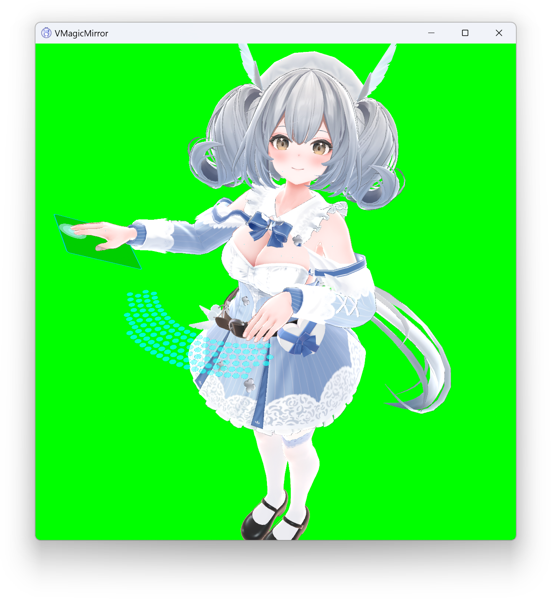
作成したVRMをVMagicMirrorで読み込んだものです。  
一般的なVRMの作成方法に加え、

- 靴位置の調整
- レースの透過
- 肩帯を腕に追従するよう親子構造を変更
- 羽と耳を非表示

といった調整を加えています。（後述）

## 作業工程
### エポナを購入する
何はともあれ3Dモデルがなければ話が進みません。  
BOOTHで販売されている3Dモデルを購入し、ダウンロードします。  
- [オリジナル3Dモデル「エポナ（Epona）」](https://tsukurunomori.booth.pm/items/4067678)

### 開発環境を整える
VRM化するための便利なツールが提供されているなんてことはなく、Unity上でポチポチモデルを弄り回してエクスポートしてやる必要があります。  
[Unity公式ページ](https://unity3d.com/jp/get-unity/download)からUnityHubをダウンロードし、UnityHub内からUnityの最新バージョンをインストールします。  
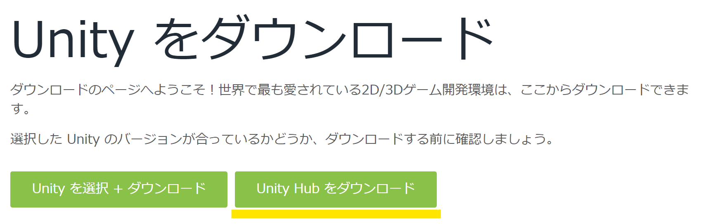

UnityHubを介さず直接Unityをインストールすることも出来ますが、UnityHub内からインストールすることで複数バージョンのUnityをインストールできるようになります。  
ここでは触れませんが、BeatSaber用のアバター形式に変換する場合は少し古いバージョンのUnityをインストールする必要があったり、何かとバージョン違いのUnityを利用する機会がありそうなのでUnityHub経由でのインストールをおすすめします。

- [Download - Unity](https://unity3d.com/jp/get-unity/download)

### UniVRMをダウンロードする
3DモデルをVRMに変換するためにはUniVRMが必要です。  
GitHubで公開されているので[リリースページ](https://github.com/vrm-c/UniVRM/releases/latest)から`UniVRM-*.**.*_****.unitypackage`をダウンロードします。
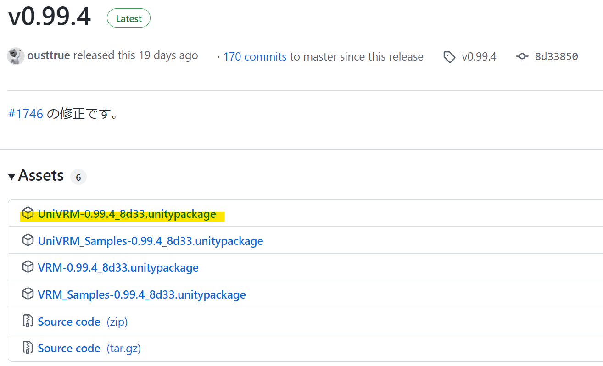
- [Release latest vrm-c/UniVRM](https://github.com/vrm-c/UniVRM/releases/latest)

### Unityプロジェクトを作成する
UnityHubを起動し、*Project*タブの*New project*をクリックします。
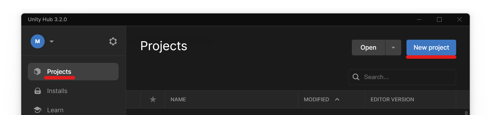

プロジェクトの新規作成画面が表示されるため、テンプレート一覧から*3D Core*を選択。  
適当なプロジェクト名を入力して*Create project*ボタンをクリックします。
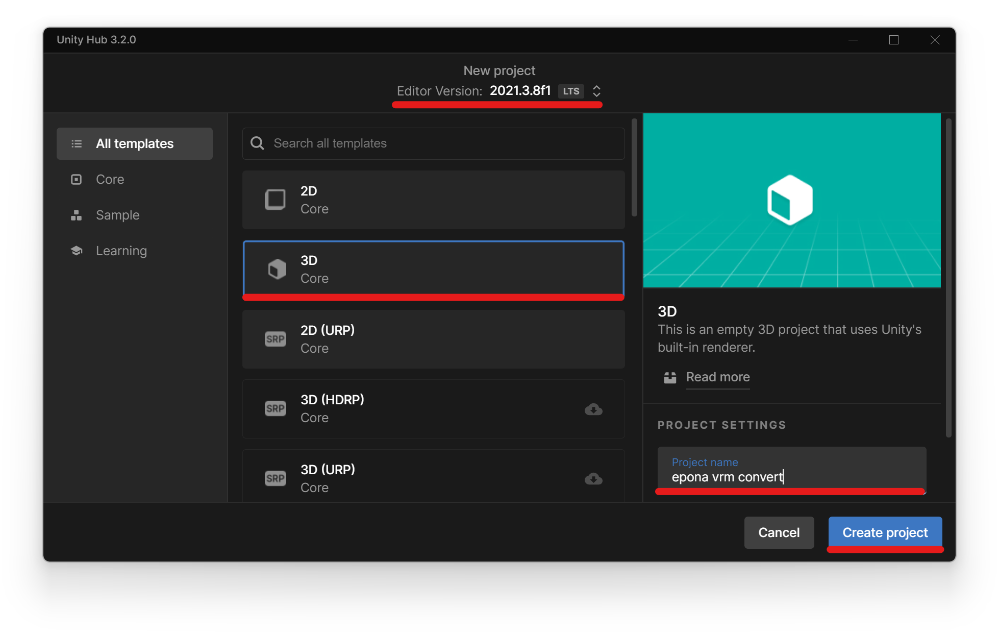
新規作成にかはなり時間がかかりますが、我慢して待ちましょう。

### UniVRMをUnityに追加する
*Project*タブで*Assets*フォルダが選択されていることを確認し、ダウンロードした`UniVRM-*.**.*_****.unitypackage`をAssets内へD&Dします。
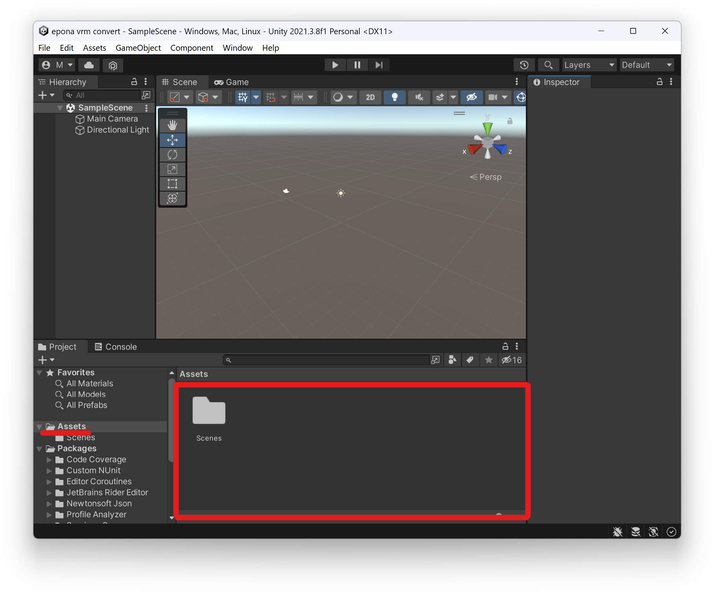

インポートウィンドウが表示されるため、左下の*Import*をクリックします。
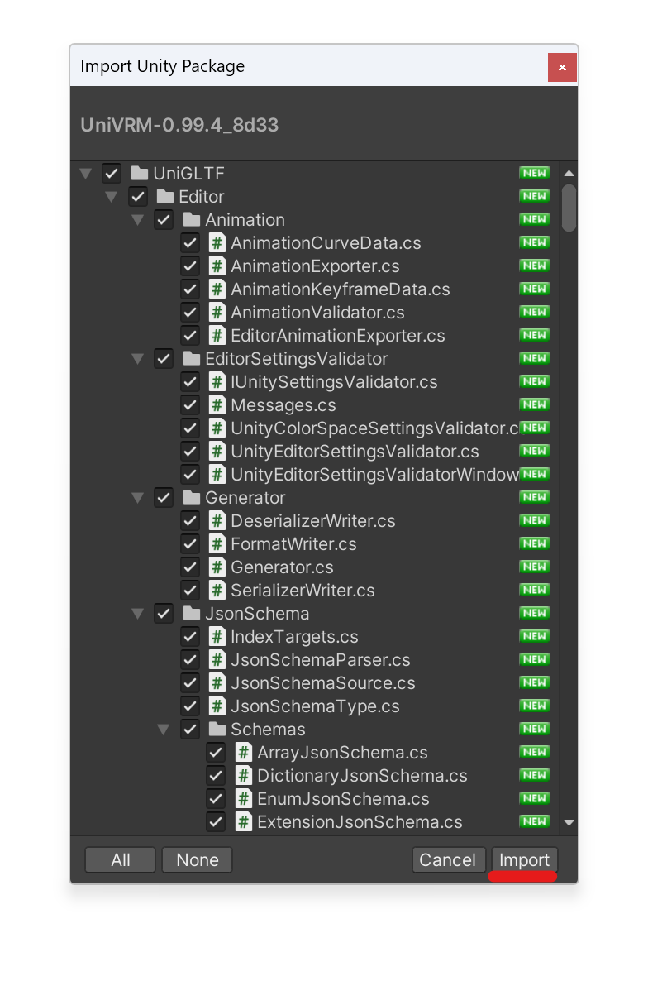

APIが古すぎるとエラーが出ました。  
よく分かりませんが、自動でアップデートしてくれるみたいなので*Yes, just for these files*を選択します。
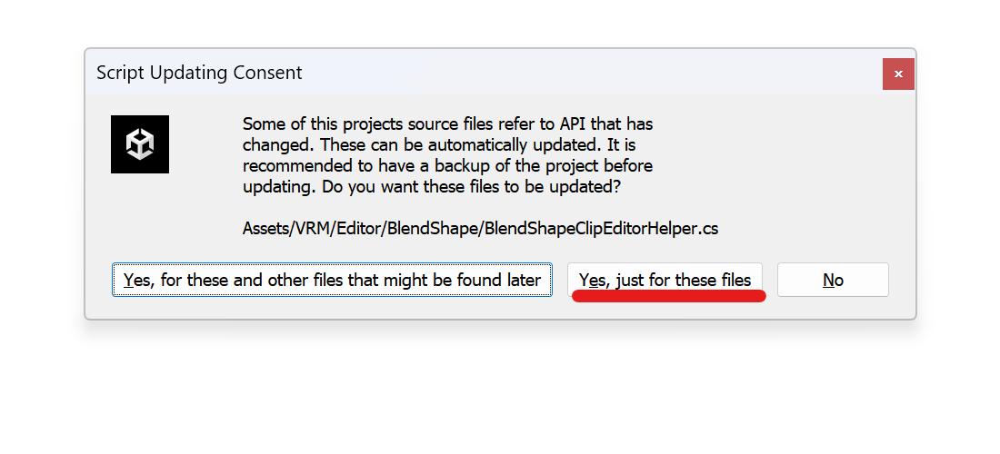

UniVRM用にプロジェクトの設定を変更するかどうかを聞かれるため、*Accept All*をクリックします。  
自動で閉じてくれるわけではないので、インポート後は*Close*ボタンをクリックしてウィンドウを閉じましょう。
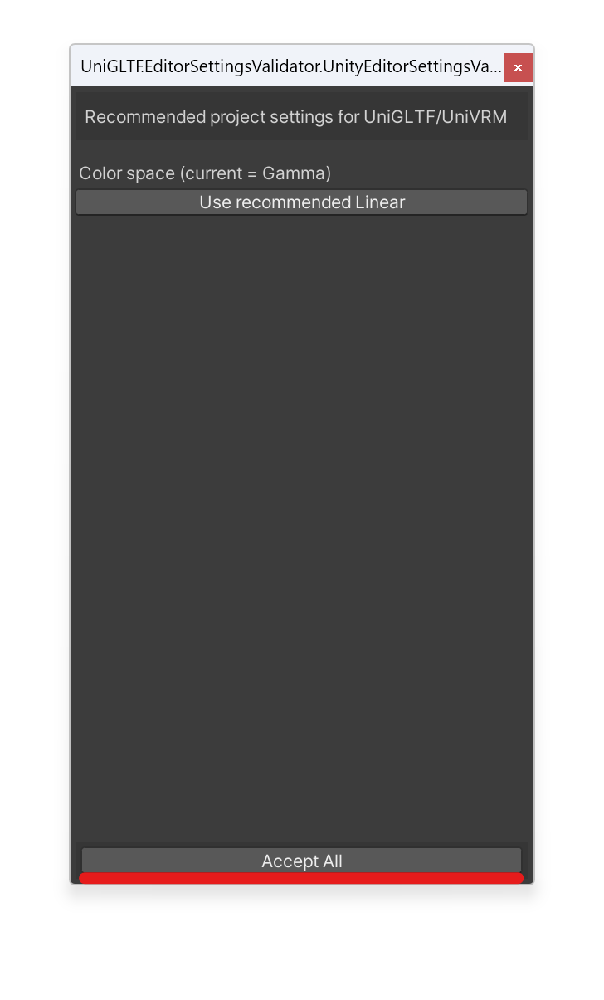

### エポナモデルをUnityに追加する
`Epona_v1.0.1.unitypackage`を先程と同様にAssetsフォルダにD&Dします。  
エポナ以外のモデルの場合はfbxファイルやテクスチャーファイルをD&Dしてやると良いはずです。

インポートウィンドウが表示されるため、*Import*ボタンをクリックします。
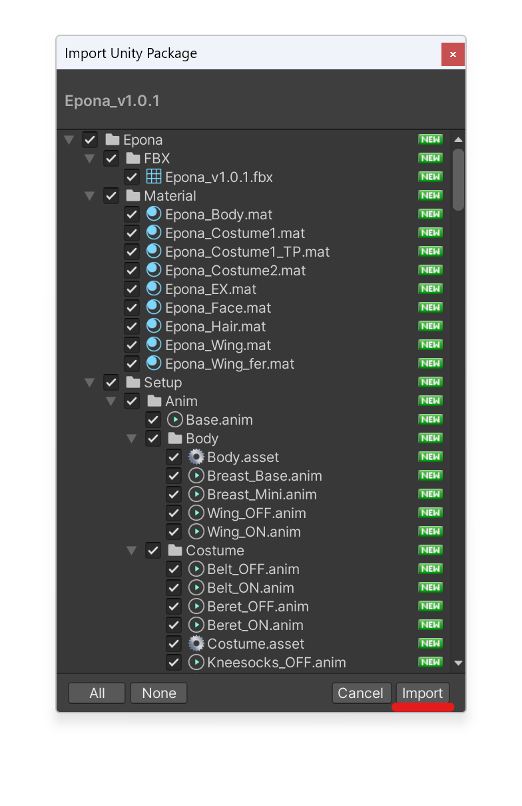

### FBXをシーンに追加する
*Assets/Epona/FBX*内のfbxファイルを*Hierarchy*ウィンドウへD&Dします。
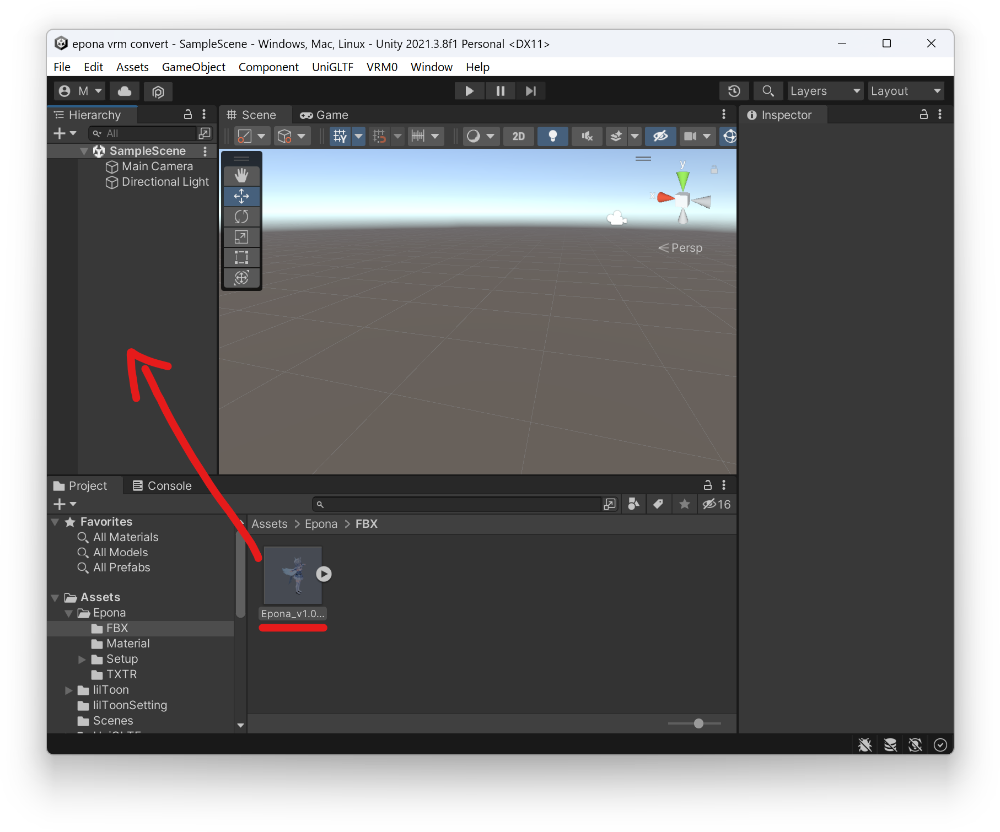

モデルが画面中央に来るよう視点を変更します。  
マウスホイールを押し込みながらドラッグで移動、右ボタンドラッグで視点回転、マウスホイールでズーム変更出来ます。

### 環境光を白色に変更する
デフォルトの環境光は黄色がかっており、色の確認に支障を来すため白色に変更します。  
*Directional Light*を選択し、*Color*を白色に変更します。
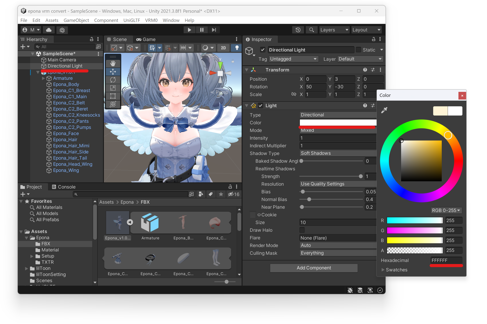

### Animatyon Typeとボーンのマッピングを確認する
エポナの場合は最初から設定されているため不要です。

*Hierarchy*で*Epona_v1.0.1*を選択し、*Inspector*の*Select*ボタンをクリックします。
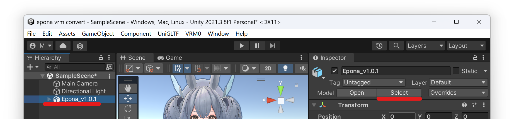

*Rig*タブを開き、*Animation Type*で*Humanoid*を選択します。
その後、*Configure*ボタンをクリックし、ボーンマッピングの確認画面へ移動します。
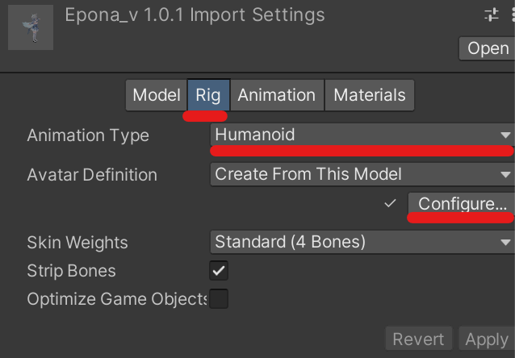

表示される人形に赤色の部分がある場合は右側の丸ボタンを押し、全身が緑色になるまでボーンを設定する必要があります。
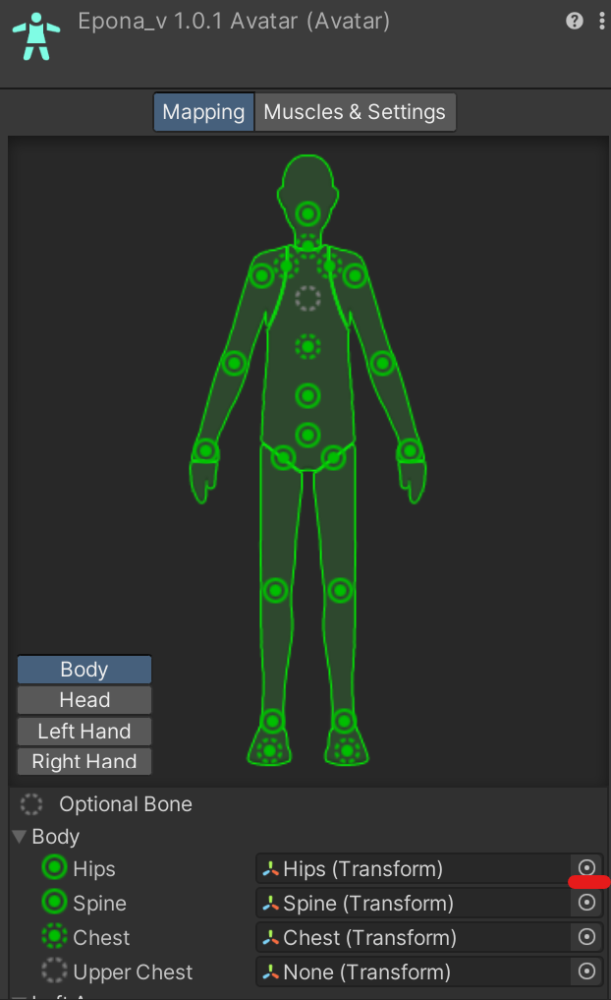

設定が終わったら*Apply*ボタンで適用し、*Done*ボタンで画面を閉じます。
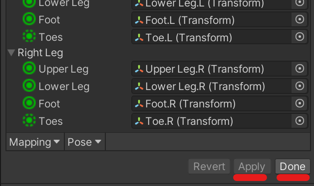

### 靴のズレを修正する（エポナのみ）

本来であれば足が靴の中に収まっているべきなのですが、貫通して中身が見えてしまっています。  
本来の位置に収まるよう靴と足の位置を調整します。

*Epona_v1.0.1*左側の*▶*マークをクリックしてツリーを展開し、*Epona_Body*を選択します。  
その後、*BlendShapes*欄をクリックしてBlendShape関連の設定を展開します。
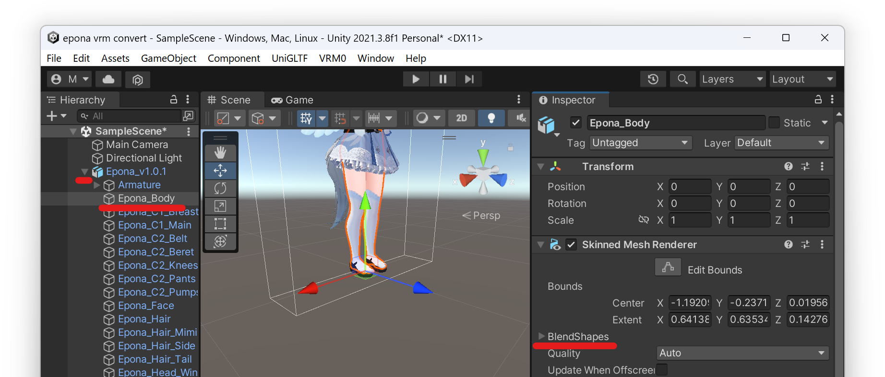

*Foot_Heel*という項目があるのでここを`50`に設定します。
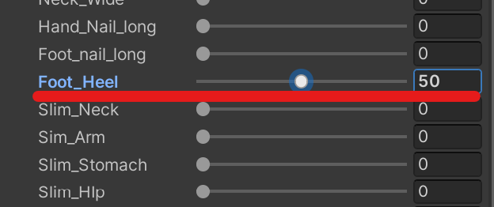

同様に*Epona_C2_Kneesocks*の*Foot_Heel*にも`50`を設定します。
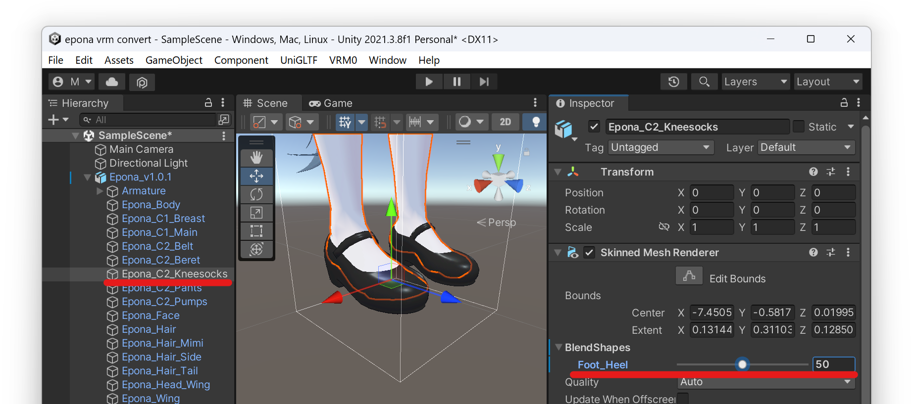

これで足が正しい位置に収まりました。  
今回は足の位置を修正するだけでしたが、他の設定項目を変更することで胸を小さくしたり、おしりを大きくしたり出来るようです。

### マテリアルの設定をする
設定されているマテリアルのシェーダーをVRM用のものに変更する必要があります。  

#### シェーダーを変更する
*Epona_Body*を選択し、*Epona_Body (Material)*の*Shader*欄右側の*Hidden/lilToonOutline*をクリックします。  
シェーダー選択画面が表示されるので、検索画面に`mtoon`と入力し、ヒットした*MToon*シェーダーを選択します。
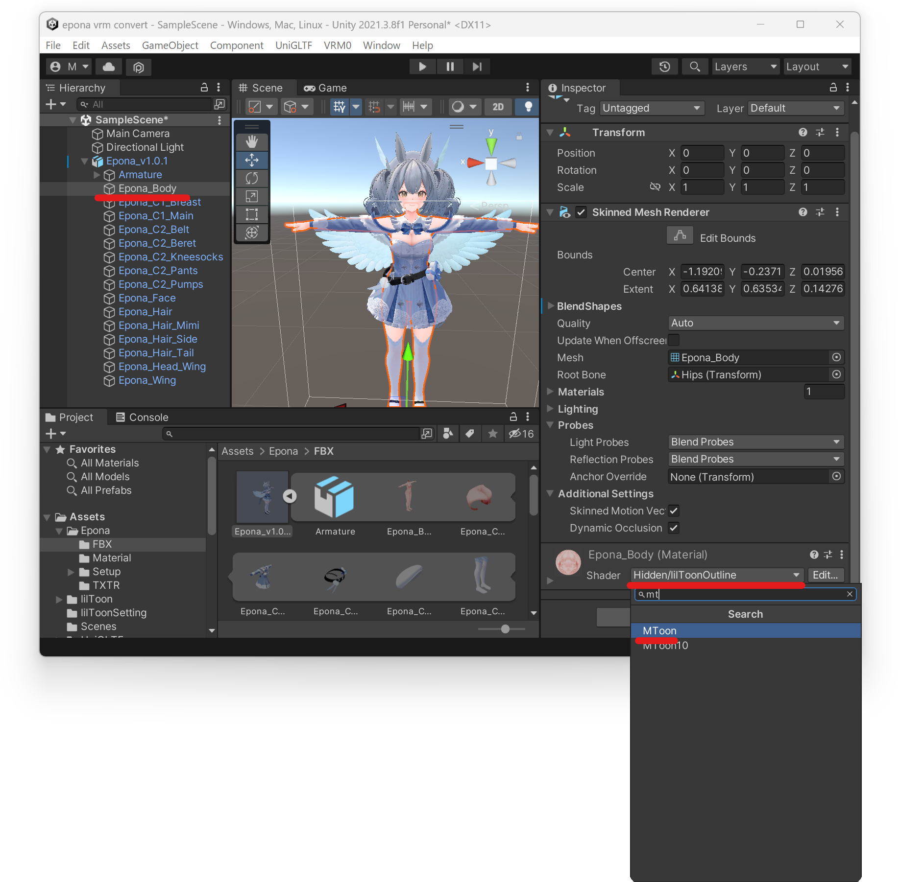

#### 影の色を変更する
デフォルトではピンクっぽい色に設定されているため、これを白か明るいグレーに変更します。  
*Shade Color*欄右側の色が表示されているエリアをクリックし、色を設定します。  
白だと少し明るすぎるように感じたため、今回はグレー寄りの`F7F7F7`に設定しました。
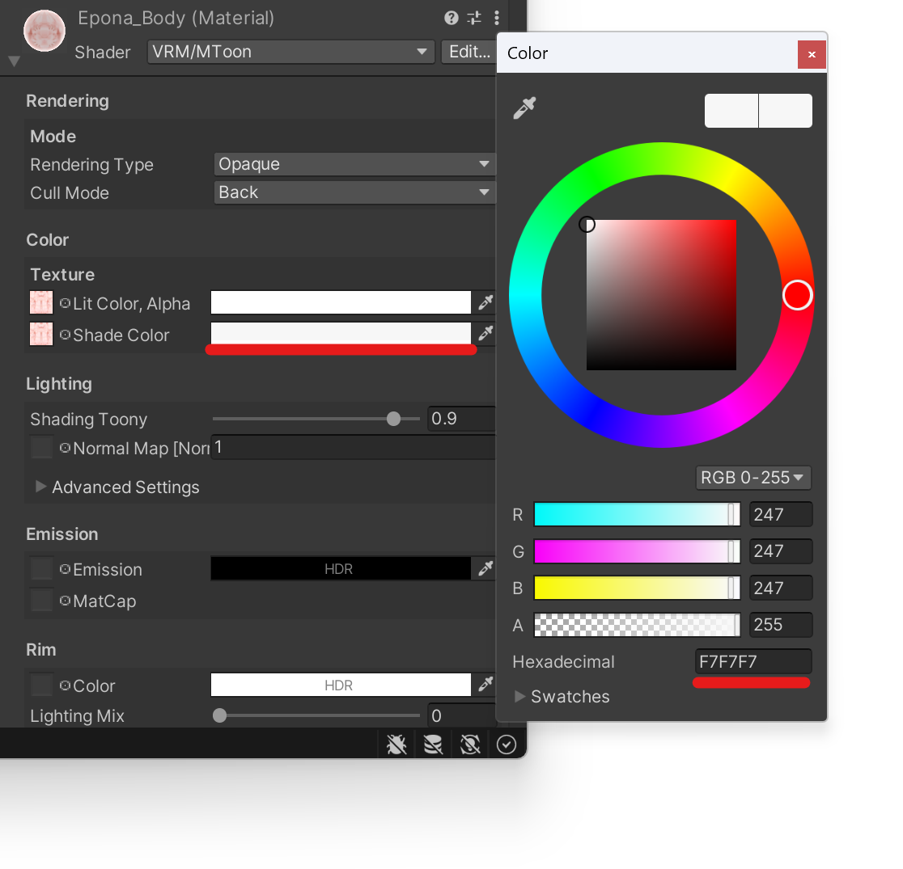

#### すべてのマテリアルの設定を変更する
*Epona_Body*～*Epona_Wing*に対して、同様にシェーダーの変更と影の色の変更の操作を行ってください。

#### 輪郭を縁取る
もとのシェーダーでは輪郭が表示されていましたが、新しいシェーダーでは輪郭が表示されなくなっています。  
*Epona_Body (Material)*、*Epona_Hair (Material)*、*Epona_Wing (Material)*に対して、マテリアル左側の*▶*ボタンをクリックして設定を展開し、*Outline*欄の*Mode*に*WorldCoordinates*を設定します。  
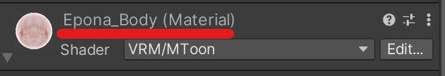
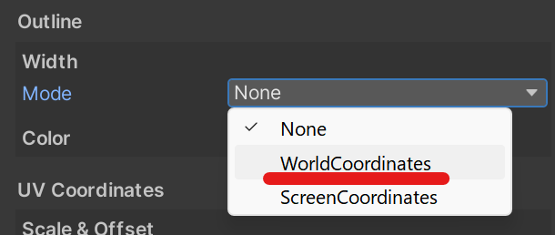

#### ポリゴンの裏側を描画するようにする
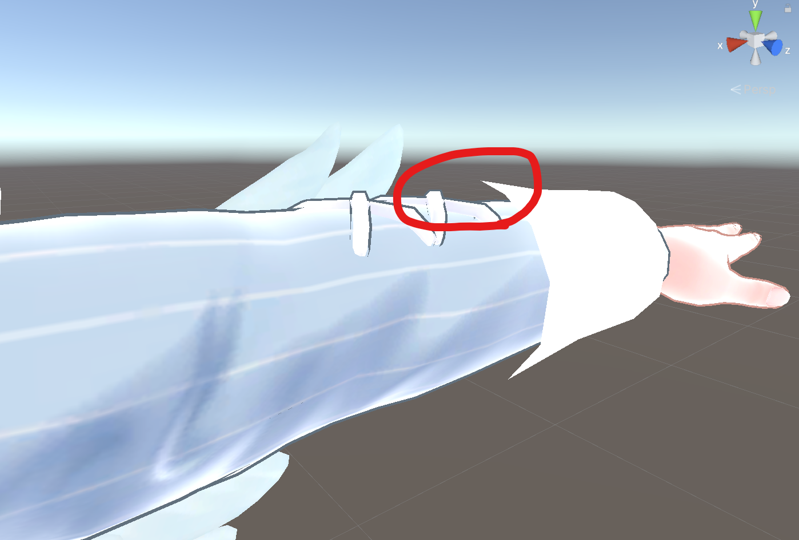
新しいシェーダーではポリゴンの裏側が描画されなくなっており、袖の裏側などが透過して向こう側が見えてしまっています。
シェーダーの設定を変更し、ポリゴンの裏側も描画されるようにします。

*Epona_C1_Main*を選択し、*Epona_Costume 1_TP (Material)*と*Epona_Costume 1 (Material)*の*Cull Mode*を*Off*に設定します。  
他のマテリアルは設定を変更する必要はありません。
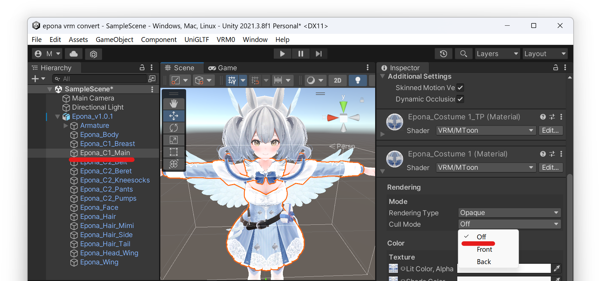

設定が完了すると、袖や肩紐の裏側が描画されるようになります。
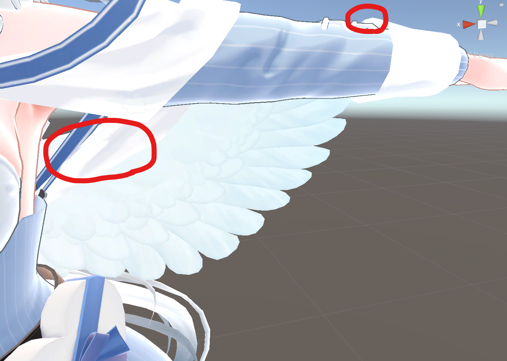

#### テクスチャを透過させる
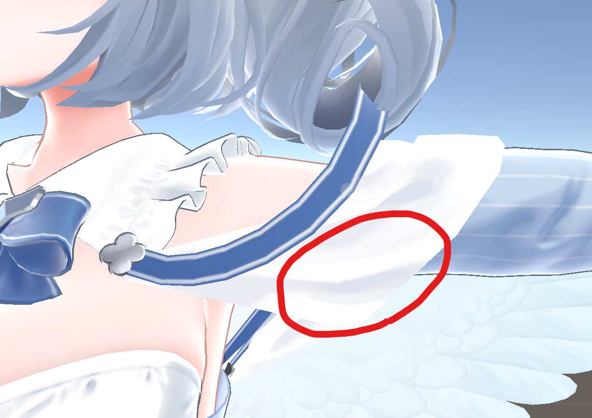
本来であればこの部分にはレースが表示されるのですが、透過処理がされていないためただの白い布になっています。  
もとのシェーダーであればアルファマスクで透過処理を実現していたのですが、新しいシェーダーにはそのような機能がないため、テクスチャを編集して透過画像に置き換える必要があります。

ClipStudioPaintを起動し、*Epona1.01\TXTR\PNG*に保存されている*Epona_Costume1.png*と*Epona_Costume1_Opacity.png*を開きます。  

*Epona_Costume1_Opacity.png*を選択し、レイヤープロパティの*表現色*欄で*グレー*を選択後、白色のアイコンをクリックします。  
白色のアイコンのみが選択された状態になると、黒色の部分が透過して表示されます。
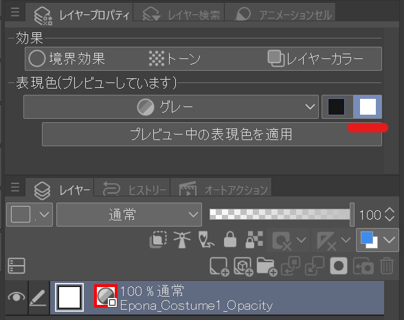

`Ctrl+A`→`Ctrl+C`でレイヤー画像をコピーし、*Epona_Costume1.png*に貼り付けます。
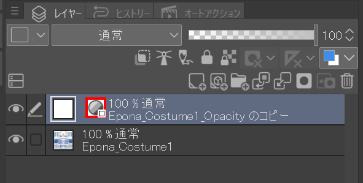

*Epona_Costume1_Opacity のコピー*が下に来るようレイヤーを並び替え、*Epona_Cosutume1*を*下のレイヤーでクリッピング*します。
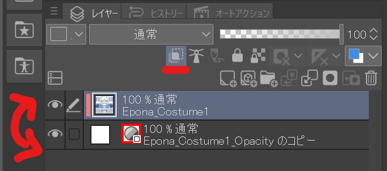

*ファイル(F)*→*別名で保存(A)*から、ファイルを保存します。  
ファイル名は何でも良いですがひとまず*Epona_Costume1_Alpha.png*として保存します。
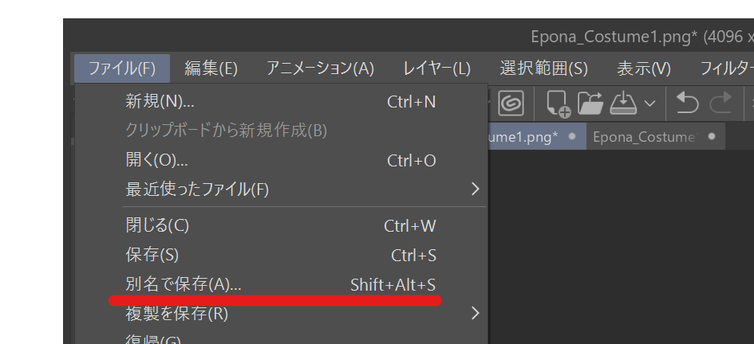

*Epona_Costume2.png*と*Epona_Costume2_Opacity.png*、*Epona_EX.png*と*Epona_EX_Mask.png*にも同様の操作をし、透過画像を生成してください。  
以後、作成したファイルの名前を*Epona_Costume1_Alpha.png*、*Epona_Costume2_Alpha.png*、*Epona_EX_Mask_Alpha.png*とした前提で進めます。

*Epona_Costume1_Alpha.png*、*Epona_Costume2_Alpha.png*、*Epona_EX_Mask_Alpha.png*を*Assets/Epona/TXTR*にD&Dします。
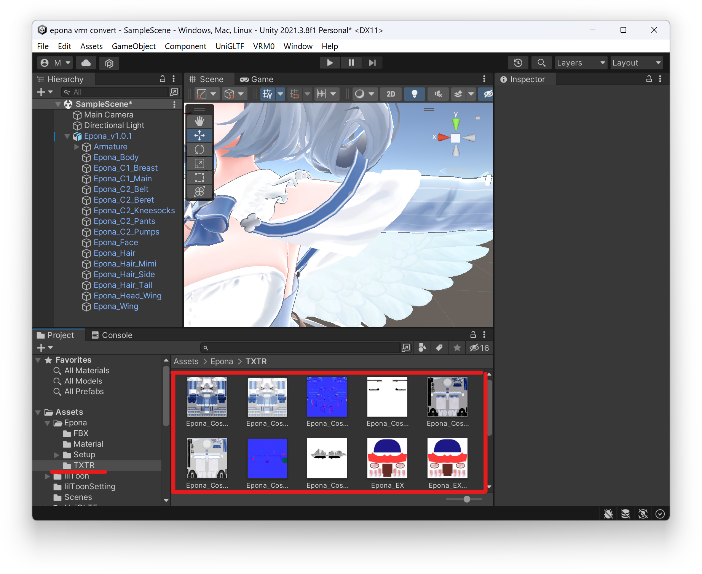

*Epona_C1_Main*を選択し、*Epona_Cosutume 1_TP (Material)*の*Rendering Type*に*Transparent*を指定します。  
*Lit Color,Alpha*欄左側の丸ボタンをクリックし、*Epona_Costume1_Alpha.png*を指定します。
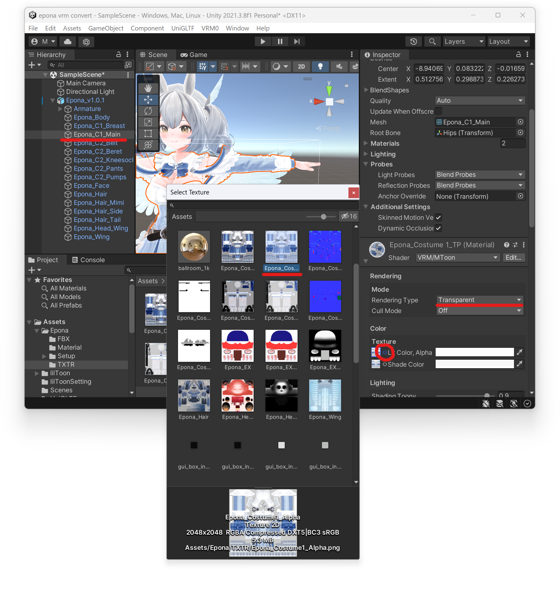

*Epona_Face*を選択し、*Epona_EX (Material)*の*Rendering Type*に*Transparent*を指定します。  
*Lit Color,Alpha*欄左側の丸ボタンをクリックし、*Epona_EX_Alpha.png*を指定します。
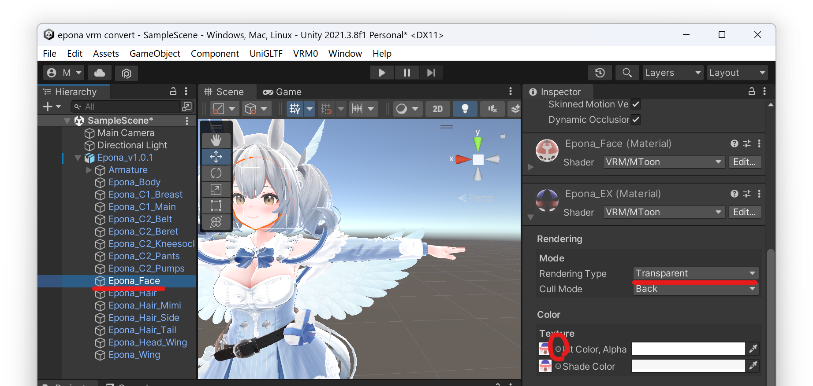

*Epona_C2_Kneesocks*を選択し、*Epona_Costume_2 (Material)*の*Rendering Type*に*Cutout*を指定します。  
*Lit Color,Alpha*欄左側の丸ボタンをクリックし、*Epona_Costume2_Alpha.png*を指定します。  
*Alpha*欄の*Cutoff*の数値を`0.3`に変更します。
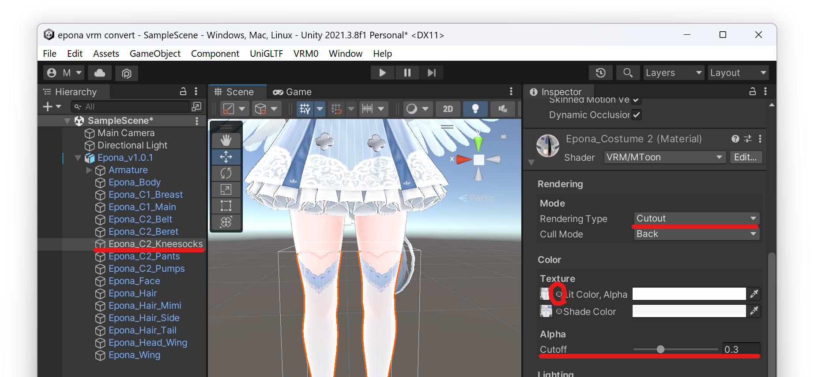

### VRMとして出力する（一回目）
*Epona_v1.0.1*を選択し、*VRM0*→*Export to VRM 0.x*をクリックします。
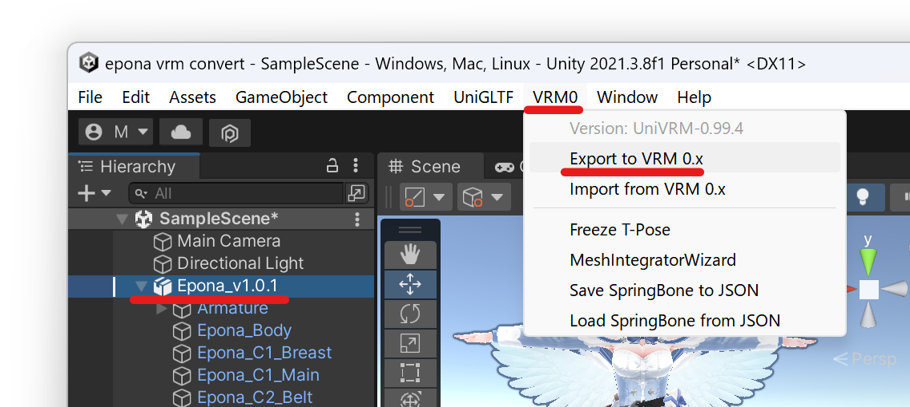

タイトル、バージョン、著者名の入力を求められるため、これを埋めてから*Export*ボタンをクリックします。
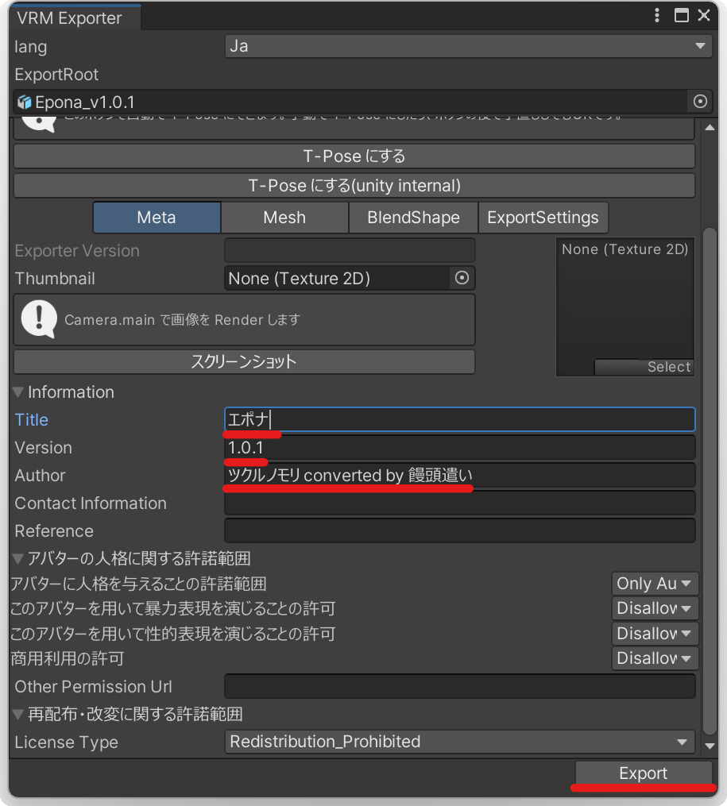

UnityProjectフォルダが開かれるため、*Assets*フォルダ内にvrmを保存してください。
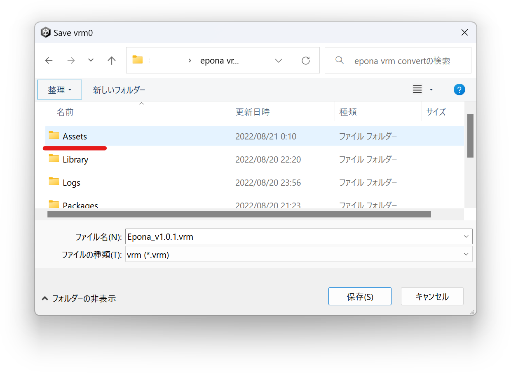

### 出力したVRMをUnityで読み込む
今まで操作していた*Epona_v1.0.1*を選択し、`Delete`キーを押して削除します。
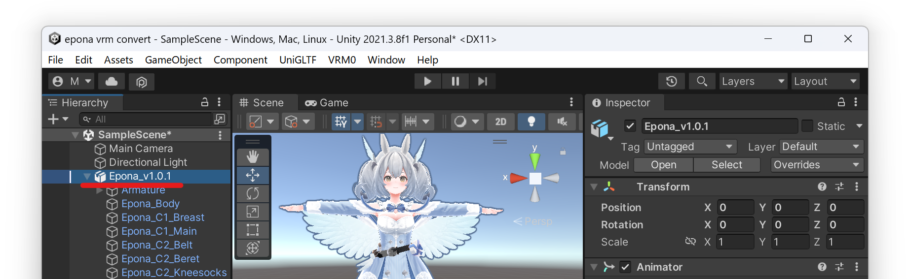

Assetsフォルダ内に*Epona_v1.0.1*が生成されているため、これを*Hierarchy*へD&Dします。
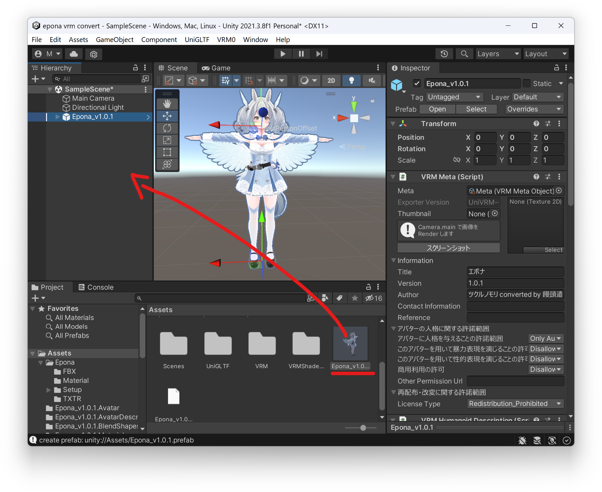

### 揺れ物の設定をする
今回はエポナの特徴であるツインテールの揺れ設定と当たり判定のみを設定します。  
必要に応じてその他のパーツの揺れを設定してください。

*Epona_v1.0.1*左側の*▶*をクリックして展開し、*secondary*を選択します。  
[揺れものの設定はすべて*secondary*に追加する必要があります。](https://twitter.com/miyumiyuna5/status/992033778548686848)
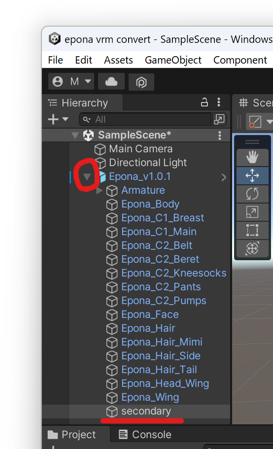

*VRM Spring Bone (Script)*の*Root Bones*左側の*▶*ボタンをクリックして展開します。  
リスト下側の*＋*ボタンを2回クリックし、それぞれの項目に*Hair_Side.L*と*Hair_Side.R*を設定します。  
ウィンドウ上の検索欄を利用するとパーツを見つけやすいです。
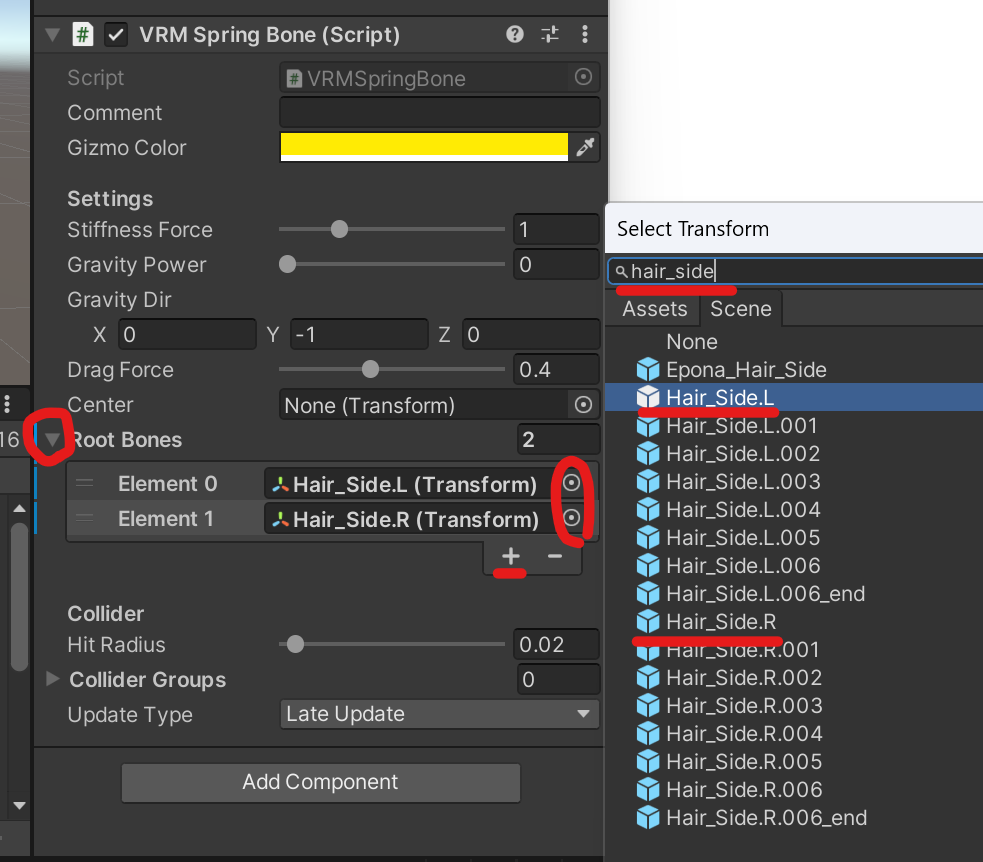

### 揺れもの当たり判定を設定する
髪の毛が肩に当たったときに貫通しないよう、肩から腕にかけて当たり判定を設定します。
*Epona_v1.0.1/Armature/Hips/Spine/Chest/Sholder.L/Upper Arm.L*を選択し、*Add Component*をクリックします。  
検索欄に`vrm spring bone`と入力し、ヒットした*VRM Spring Bone Collider Group*を選択します。
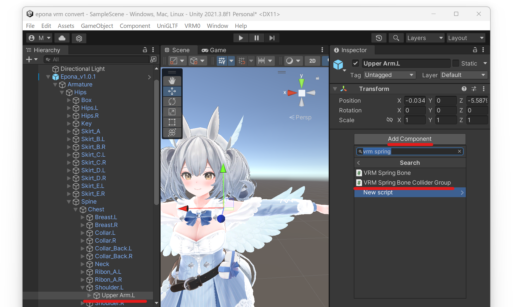

*Colliders*右側のテキストボックスに`4`を入力します。  
設定できる*Element*の数が増えるので、*Radius*を`0.05`に、*Offset*を`-0.05`刻みで設定します。  
うまく設定できると、腕に沿って紫色の当たり判定が横一列に並んで表示されます。
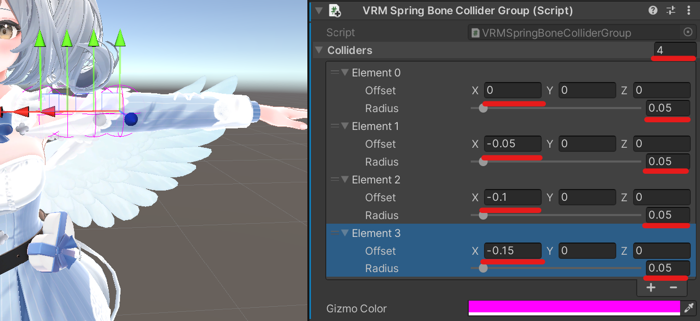

右腕にも同じ設定をしたいので、*VRM Spring Bone Collider Group*と書かれた部分を右クリックし、*Copy Component*を選択します。
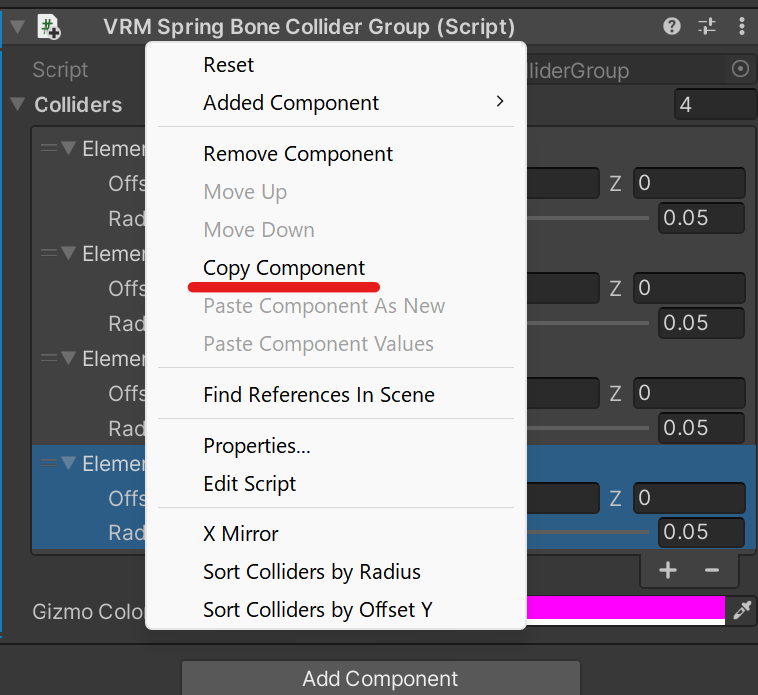

*Epona_v1.0.1/Armature/Hips/Spine/Chest/Sholder.R/Upper Arm.R*を選択します。  
*Transform*と書かれた部分を右クリックし、*Paste*→*Component As New*を選択します。

左右反転しているので、X軸の数値のマイナスを消します。
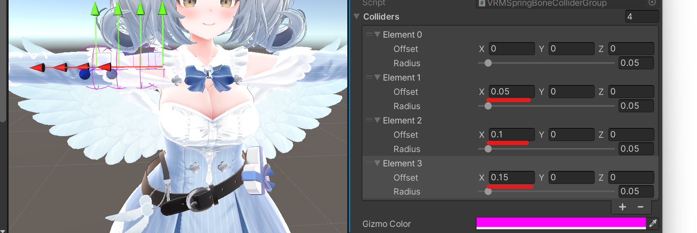

*secondary*に戻り、*Collider Groups*に`2`を指定し、各項目に*Upper Arm.L*、*Upper Arm.R*を指定します。
これで髪の毛が腕にあたった際に貫通しなくなります。
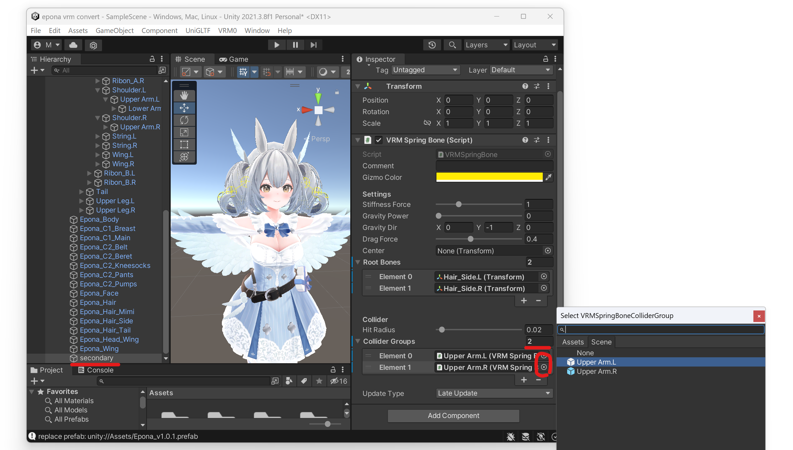

### 肩の帯を揺らす 
肩青いの帯を揺らすためには、少しモデルの構造を変更してやる必要があります。

#### 帯が肩に追従するようにする
*Epona_v1.0.1*を選択し、*Open*ボタンをクリックします。
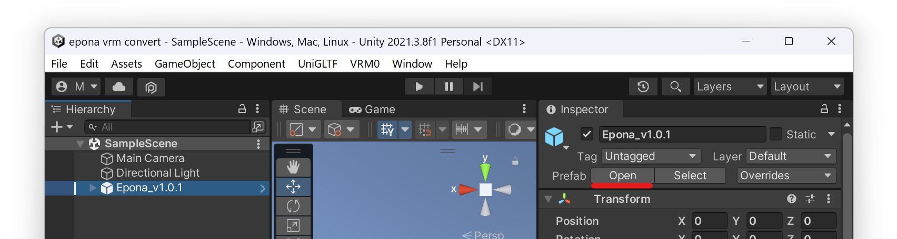

*Epona_v1.0.1/Armature/Hips/Spine/Chest/String.L*を*Epona_v1.0.1/Armature/Hips/Spine/Chest/Sholder.L/Upper Arm.L*にドラッグし、*Epona_v1.0.1/Armature/Hips/Spine/Chest/Sholder.L/Upper Arm.L/String.L*となるよう移動させます。  
*String.R*も同様に移動します。
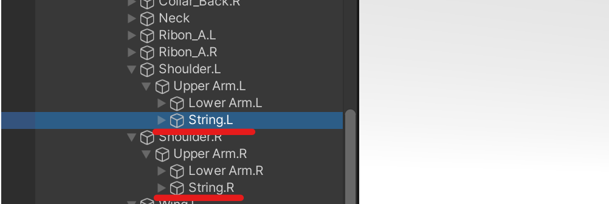

*String.L.001*を選択後、プレビューエリア左上の回転ボタンをクリックし、好みの位置まで帯を回転させます。
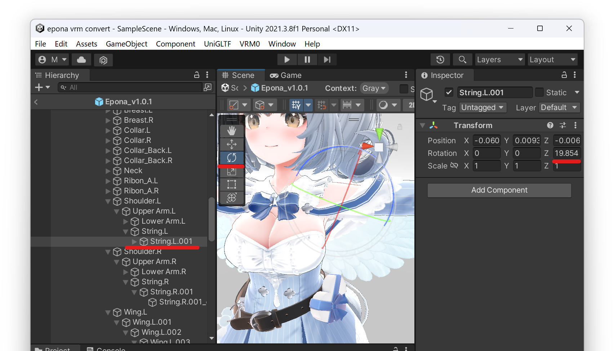

*String.R.001*も同様に回転させたら、左上の*<*ボタンを押して編集画面を閉じます。
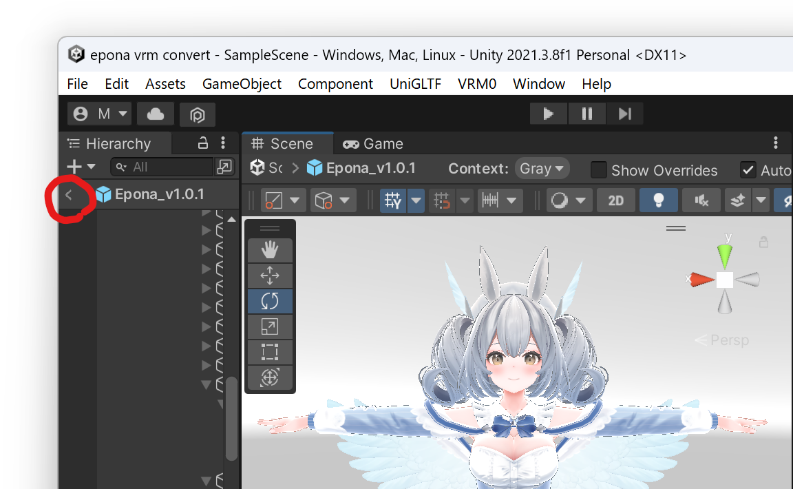

#### 帯用のコライダーを設定する
帯の可動範囲を制限するためのコライダーを追加します。  

*String.L*を選択し、*Ctrl+D*を押して複製します。  
複製後のアイテムはそれぞれ*StringC.L*、*StringC.L.001*、*StringC.L.001_end*にリネームします。
*String.R*も同様に複製します。
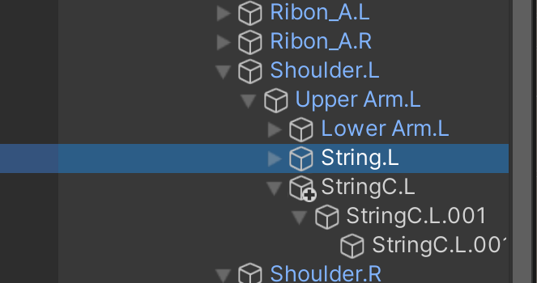

*StringL.C*に*VRM Spring Bone Collider Group*を追加します。  
*Y*に`-0.05`、*Radius*に`0.02`を設定してください。
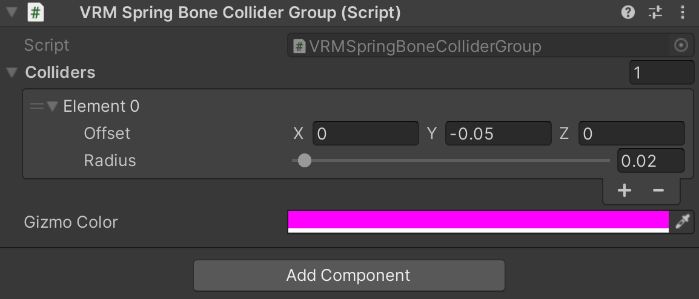

この設定を使いまわしたいので、*VRM Spring Bone Collider Group*と書かれている部分を右クリックし、*Copy Component*を選択します。
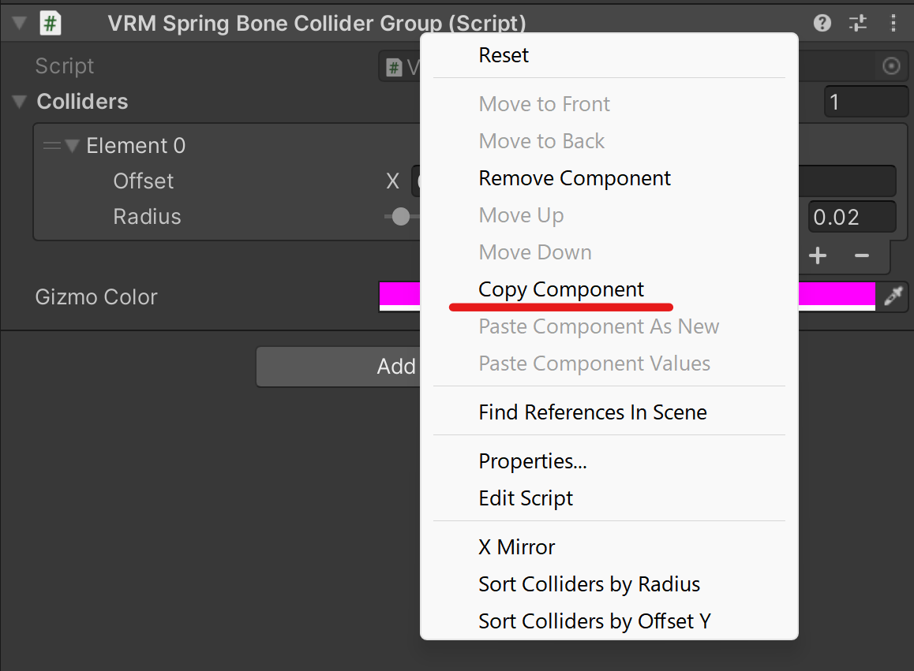

*StringC.L.001*、*StringC.L.001_end*、*StringC.R*、*StringC.R.001*、*StringC.R.001_end*にコンポーネントを貼り付けます。
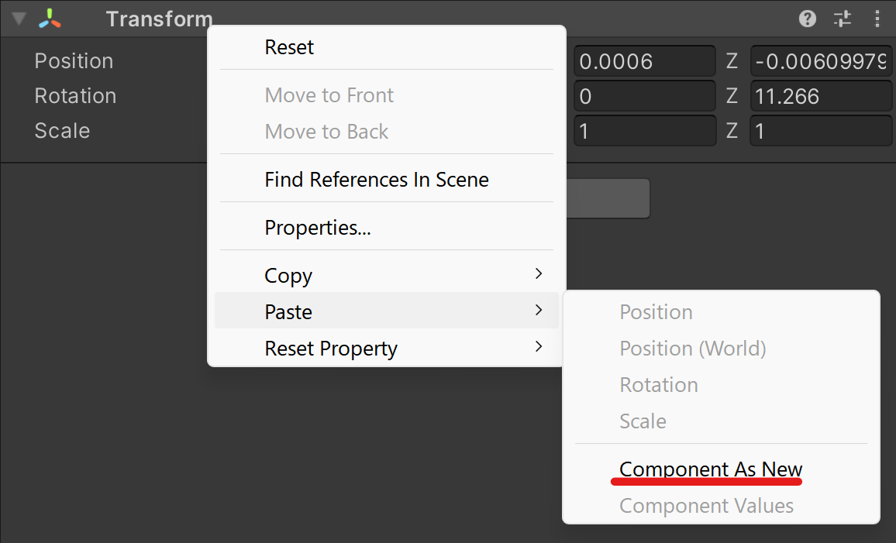

*secondary*を選択し、*String.L*と*String.R*に*Spring Bone*を設定します。  
コライダーが干渉するため、他の揺れものと*VRM Spring Bone*を分ける必要があります。    
*Stiffness Force*を`0.5`に設定して少しふわふわとした動きにしています。
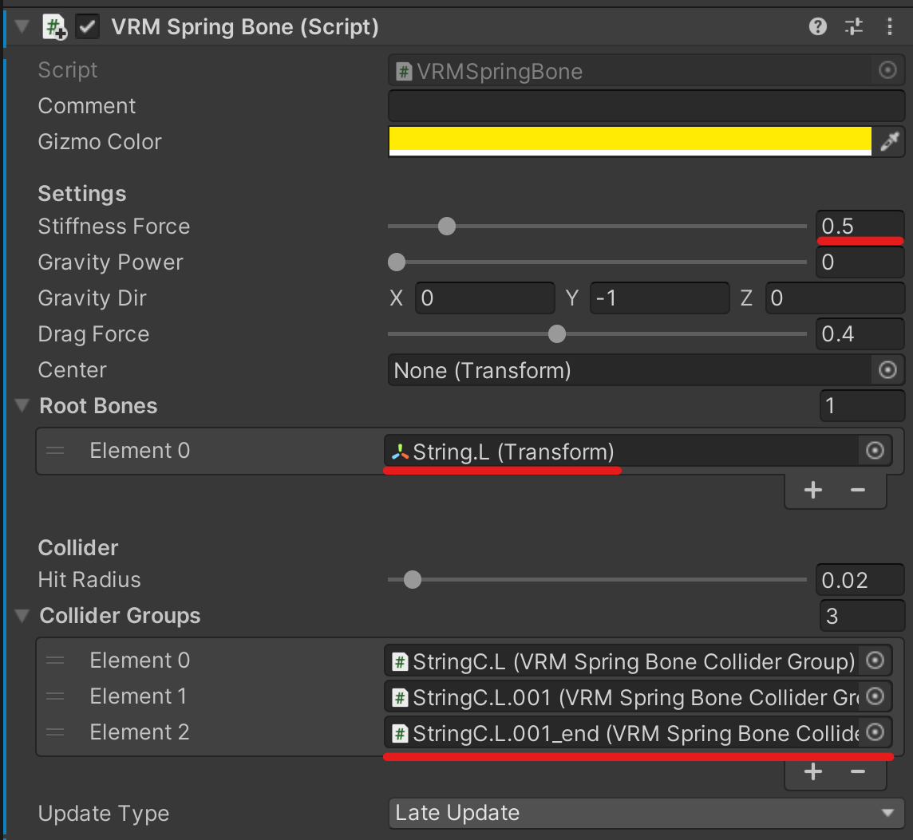

### 表情を設定する
瞬きや口パクを設定します。

*Epona_v1.0.1*を選択し、*VRM Blend Shape Proxy*の*BlendShape (Blend Shape Avatar)*と書かれた部分をダブルクリックします。
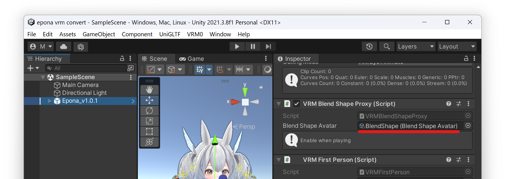

あ、い、う、え、お、まばたき、喜、怒、哀、楽、視線の上下左右、ウインクの表情を指定します。  
画面下にプレビューが表示されるので、そこを見ながら表情を調整してください。
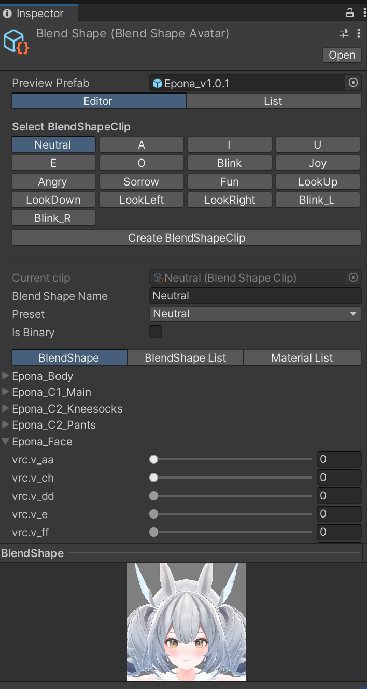

### VRMを出力する（2回目）
すべての設定が完了したため、VRMとして最終出力します。

*Epona_v1.0.1*を選択し、*VRM0*→*Export to VRM 0.x*を選択します。
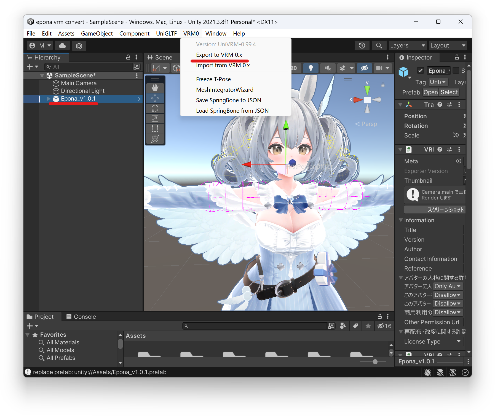

タイトルやバージョンは入力されているので、そのまま*Export*ボタンをクリックします。  
デスクトップ等好きな場所にvrmを保存してください。
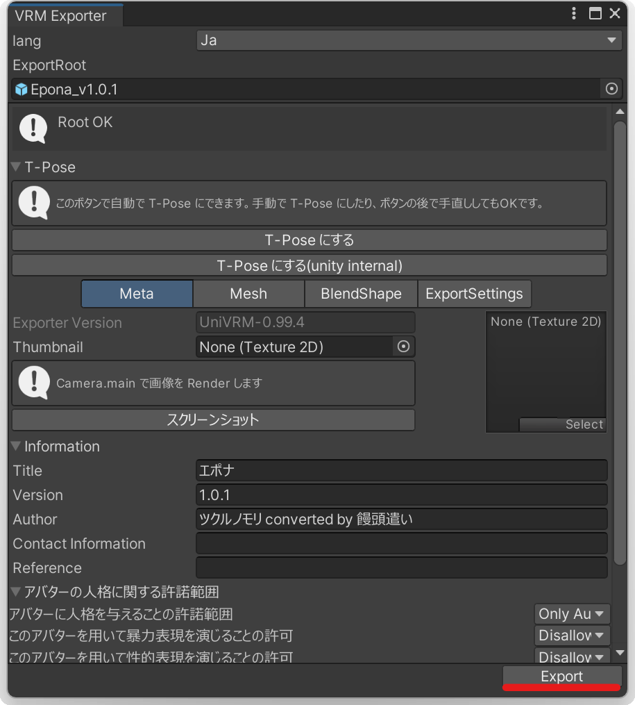

以上でVRMへの変換作業は終了です。  
設定内容はUnityProject側にも保存されているため、揺れ物を追加したい場合はプロジェクトからいつでも設定を再開できます。

### おまけ：特定のパーツを非表示にする
非表示にしたいパーツを選択し、*Inspector*タブのパーツ名左側のチェックボックスを外すとパーツを非表示に出来ます。  
この状態でVRM出力すると、パーツが消えた状態のままファイルが作成されます。
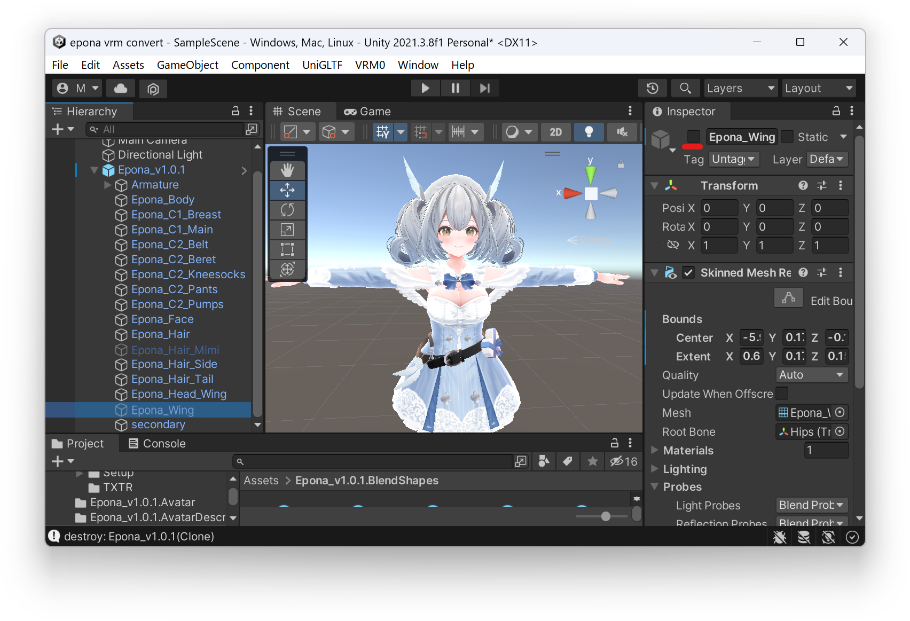