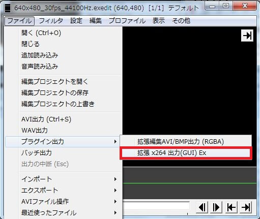
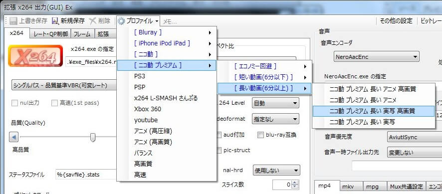

## x264guiExを使用する
ニコニコ動画の多くの高画質動画に使用されています。
AviUtlでx264を使用するには以下のプラグインを使用します。

### x264guiExのダウンロード/インストール
[rigayaの日記兼メモ帳](https://rigaya34589.blog.fc2.com/)からx264guiExをダウンロードし、インストールします。
ダウンロードしたzipファイルを解凍すると、中に「auo_setup.exe」というファイルがあるのでこれを実行します。
表示される手順に沿ってインストールを進めてください。

### x264guiExのプロファイルを選択する

インストールが終わると、AviUtlのプラグイン出力の項目に「拡張x264出力(GUI)Ex」が追加されています。  
これをクリックし、表示される動画保存ダイアログ下部の「ビデオ圧縮」をクリックするとエンコードの設定ウィンドウが表示されます。

拡張x264出力(GUI)Exの設定画面上部に「プロファイル」という項目があるので、そこに表示されているニコニコ動画用のプロファイルを選択します。  
下手に設定をいじるよりもここにあるプロファイルを使用するほうが高画質の動画を作ることができるので、エンコードの設定に詳しくない人はまずはこれを使用することをお勧めします。  

自分で設定をいじりたい！という人は、以下のページを参考にしてください。
- [AviUtlを使ったMP4 (H.264) エンコード – ニコニコ動画まとめwiki](http://nicowiki.com/aviutl_h264.html)
- [ニコニコ動画に高画質な動画をアップロードする方法 – VIPで初心者がゲーム実況するには＠Wiki](https://w.atwiki.jp/live2ch/pages/497.html)

