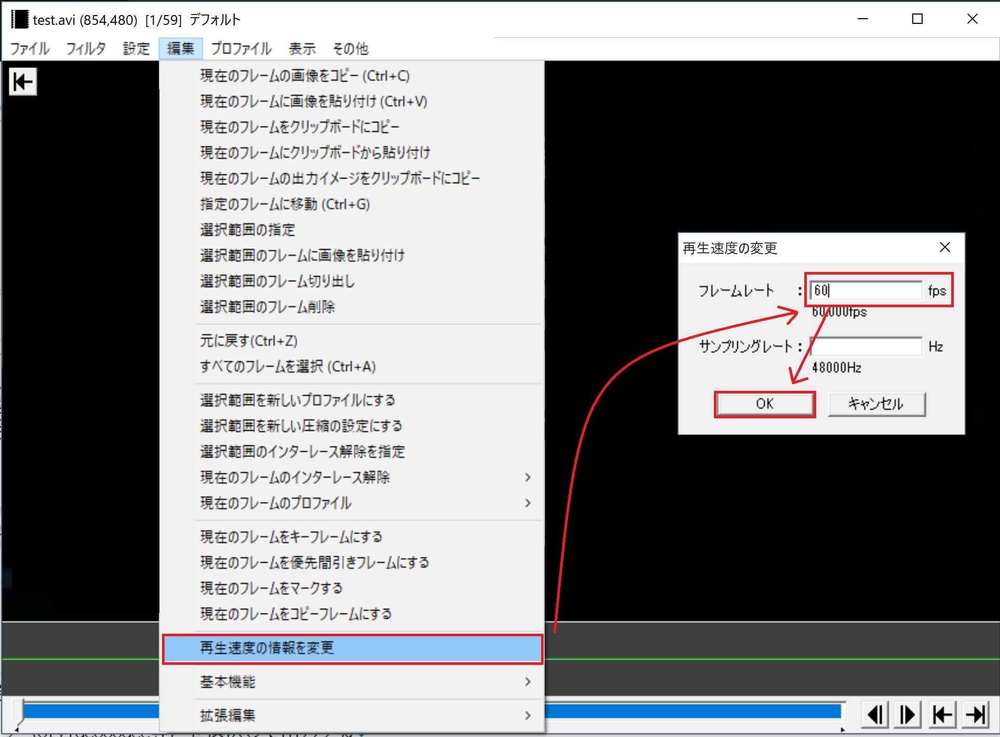

## FPS欄が正常に設定されているかどうかを確認する
ゆっくりMovieMaker側で動画ファイルのFPSを取得できていない可能性があります。  
手動でFPSの値を入力することで、問題を解消することが出来ます。

1. ゆっくりMovieMaker側で、問題の動画アイテムのアイテム編集ウィンドウを開く
1. FPS欄に、使用している動画のFPSの数値を入力する
1. タイムライン上の全ての動画アイテムに「2」と同様の作業をほどこす
1. exo出力
1. AviUtl上で正常な位置でカットできているかどうか確認する

 
## 上記作業を行っても問題が解決しない場合
1. 使用したい動画ファイルをAviUtlで読み込む
1. 「AviUtlのメニュー→編集→再生速度の情報を変更→フレームレート」で、動画のフレームレートを指定する

1. Avi出力で可逆圧縮コーデック（UtVideoCodec等）を選択して出力する

1. YMM側で使用している動画を上記方法で出力した動画と差し替える
1. アイテム編集ウィンドウ→FPS欄が「2」で指定した数値になっているかどうか確認する
1. exo出力
1. AviUtl上で正常な位置でカットできているかどうか確認する