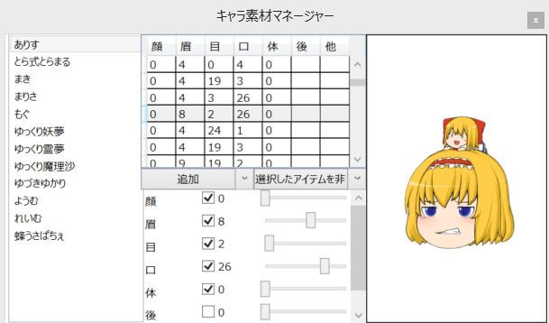
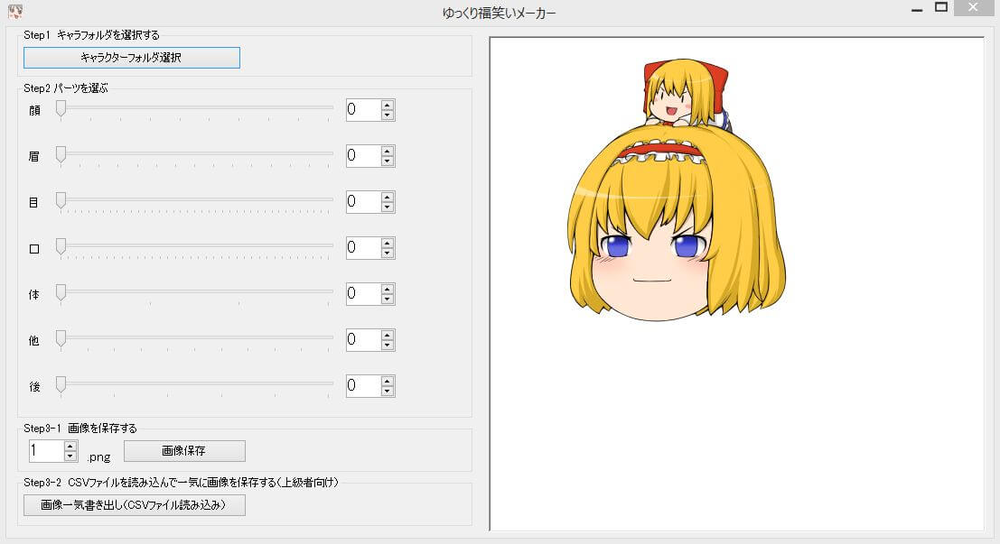

## キャラ素材マネージャーを使用する
ゆっくりMovieMaker上部ウィンドウから、  
設定→キャラ素材マネージャー を選択するとキャラ素材マネージャーが表示されます。  
キャラ素材マネージャーの詳細・使用方法は「[キャラ素材マネージャー](/ymm3/help/charasozaimanager/)」のページをご覧ください。

## ゆっくり福笑いメーカー（外部ソフト）を使用する

とら氏制作の「ゆっくり福笑いメーカー」を使用することでも非アニメーション素材を出力可能です。
- 配布元：[とらストレージ](https://sites.google.com/site/trastrage/)