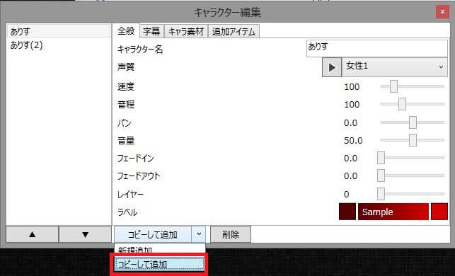
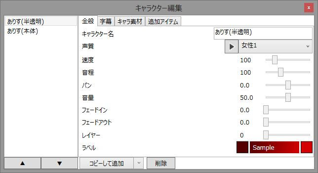
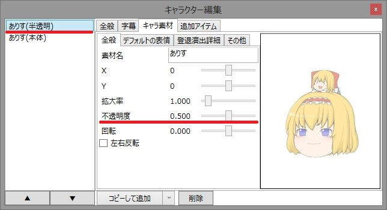
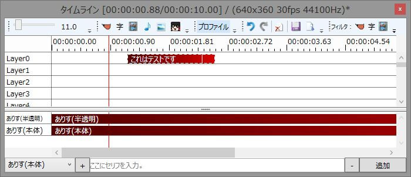
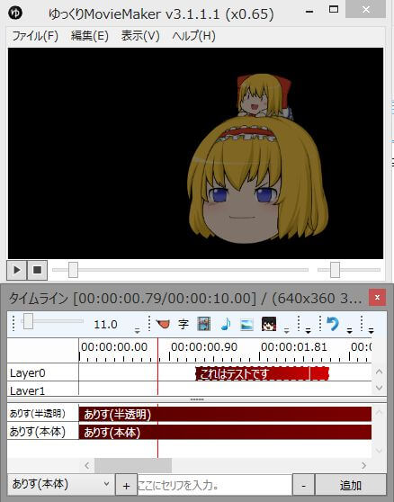
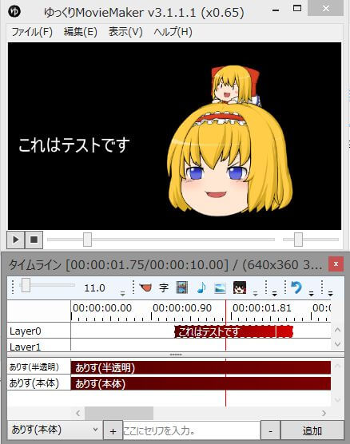

ゆっくりMovieMakerの機能に喋っている時以外はキャラ素材を半透明にするという機能はありませんが、以下の方法で再現が可能です。

## 手順
1. 表示させたいキャラクターをコピーする

1. キャラクターを複製し、「キャラ名（半透明）」「キャラ名（本体）」とリネームする  
※必ず「半透明」を「本体」より上にしてください。

1. 片方を半透明に、もう片方を「セリフ無し表示」のチェックを外す

※この時「半透明」のキャラクターの「セリフ無し表示」にチェックが入っていることを確認してください。
1. 「半透明」「本体」両方のキャラ素材ベースアイテムをタイムラインに追加する

1. 「本体」キャラクター側でゆっくりボイスを追加する

## 結果

↓
