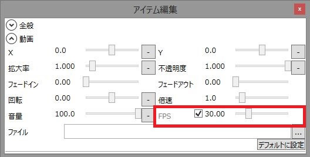

## 動画のプレビュー方式を変更する
メインウィンドウ上部のメニュー→ファイル(F)→設定(S)→プレビュータブ  
と、画面を移動し、「プロジェクトプレビュー」で

- DirectShowVMR9
- DirectShowEVR

のどちらか、現在選択していないほうを選択し、動画が再生できないかどうか確認してください。  
変更後は必ずゆっくりMovieMakerを再起動して下さい。

## コーデックパックを導入する
動画のプレビュー方式を変更しても動画が表示されない場合、再生に必要なコーデックパックをインストールする必要があります。  
使用しているPCにコーデック/スプリッターがインストールされているかどうか、正常に設定されているかどうか、確認してください。  
また、64bitOSを使用している場合であっても、32bit版のコーデックがインストールされているかどうか、確認してください。

### お断り
動画が読み込めない現象に関しては、ユーザーごとにPC環境や録画環境による違いが大きく、サポートが困難なためメールやTwitterで質問をされても回答はできませんので予めご了承ください。

多くの場合は以下のコーデックパックをインストールすることで症状は改善されますが、これでも症状がおさまらない場合は自力での解決をお願いします。
また、各種コーデックパックのインストールは各自自己責任で行うよう、お願いします。

### 注意
複数のコーデックパックをインストールすると、正常にコーデックが適用されない可能性があります。
すでにインストールしているコーデックパックがある場合、アンインストールした後、コーデックパックをインストールしてください。

- [コーデックパック一覧](https://www.gigafree.net/media/codecpackage/)

## 再度、動画のプレビュー方式を変更する
コーデックパックをインストールしても動画が表示されない場合、動画のプレビュー方式を変更すると、正常に動画が表示されるようになることがあります。  
メインウィンドウ上部のメニュー→ファイル(F)→設定(S)→プレビュータブ  
と、画面を移動し、「プロジェクトプレビュー」で

- DirectShowVMR9
- DirectShowEVR

のどちらか、現在選択していないほうを選択し、動画が再生できないかどうか確認してください。  
変更後は必ずゆっくりMovieMakerを再起動して下さい。

## 再生方式でMediaElementを選択する（非推奨）
WindowsMediaPlayerで正常に動画が再生できるのにもかかわらず、ゆっくりMovieMakerではどうしても再生できない場合、動画の再生方式で「MediaElement」を選択すると正常に再生されるようになる可能性があります。

メインウィンドウ上部のメニュー→ファイル(F)→設定(S)→プレビュータブ  
と、画面を移動し、「プロジェクトプレビュー」で「MediaElement」を選択します。  #
変更後は必ずゆっくりMovieMakerを再起動して下さい。

「MediaElement(非推奨)」を選択すると多くの動画をプレビュー可能になりますが、動画アイテムのFPSを手動で設定しないと正常にexo出力できなくなる点に注意が必要です。  
動画のFPS（フレームレート）取得処理にDirectShowを利用しているため、「MediaElement」でのみ読み込み可能な動画ファイルを使用する場合、動画のFPSを取得することが出来ません。  
このため、**動画のFPSを手動で設定する必要があります。**

