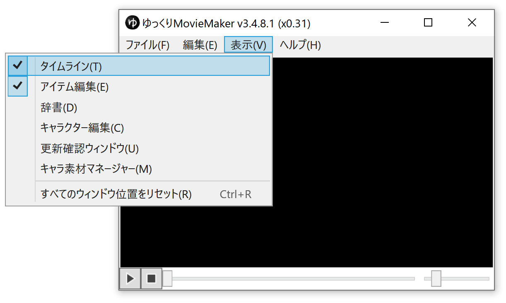

## メインウィンドウが表示されない場合
### 方法1
1. YMM3を起動する
1. タスクバーでYMM3のウィンドウを選択する
1. Ctrl+Rキーを押す

### 方法2
1. YMM3を起動する
1. タスクバーでYMM3のウィンドウを選択する
1. Alt+スペースキーを押す
1. 移動(M) を選択する
1. 矢印キーを押す
1. マウスを動かしてウィンドウを画面内に移動させる
1. クリックする

## メインウィンドウが表示されている場合

1. 表示 → 表示したいウィンドウ（タイムライン・アイテム編集 等）を選択し、チェックを入れる
1. チェックを入れても表示されない場合、「すべてのウィンドウ一をリセット」を選択する