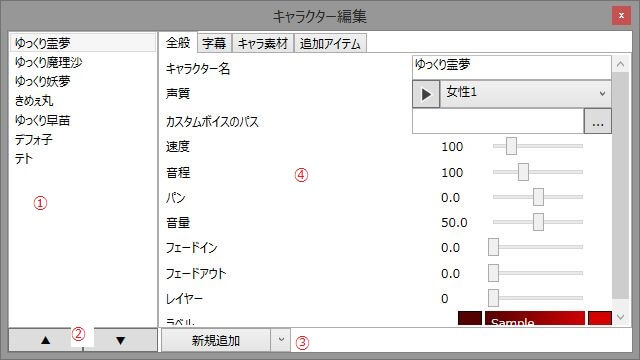

キャラクターの各種設定を行います。

## 1. キャラクターリスト
現在作成されているキャラクターのリストです。  
このリストの下のキャラクターほど、キャラ素材や字幕が手前に表示されます。

## 2. キャラクターを並び替える
現在のキャラクターを上に/下に移動させます。

## 3. キャラクターの追加/削除
### 新規追加
キャラクターを新規追加します。
### コピーして追加
現在のキャラクターをコピーして追加します。
### 削除
現在のキャラクターを削除します。  
キャラクター選択→Deleteキー でもキャラクターを削除できます。

## 4. キャラクターの編集
選択中のキャラクターを編集します。