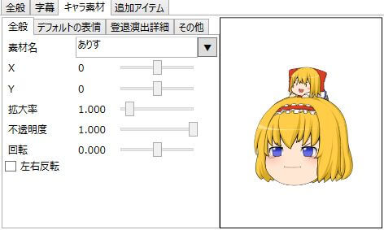

キャラ素材のに関する設定を行います。

## 素材名
キャラ素材の素材名（フォルダ名）を入力します。  
キャラ素材の使用方法に関しては「[キャラ素材を使用する準備をする](../../tutorial/charasozai/index.md)」を参照。  
正常に素材名が入力されている場合、画面右側に使用するキャラ素材のプレビューが表示されます。

素材名入力欄右の「▼」ボタンをクリックし、一覧からキャラ素材名を選択することでも素材の指定が可能です。

## その他の設定項目
- [キャラ素材ベースアイテム](../editor/h2013419141542403.md)