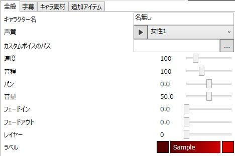

ゆっくりボイスの基本的な設定を行います。

## キャラクター名
キャラクターの名前を設定します。

## 声質
使用する音声合成エンジンを指定します。

## カスタムボイスのパス
タイムラインにwav/mp3ファイルをD&Dした時、ファイル名にココで指定したパスが含まれていた場合、ファイルをカスタムボイスとして扱います。  
「D:\voice\」等の絶対パスや、「yukkuri」等のファイル・フォルダ名指定可能です。

## 速度
セリフの読み上げスピードを指定します。

## 音程
ゆっくりボイスの音程を設定します。  
この数値を変更すると、音声の再生速度も変化してしまう点に注意してください。  
再生速度を維持したまま音程を変化させたい場合、音程の増加分スピードを減少させてください。  
（例：音程100→120　スピード100→80）

## パン
ゆっくりボイスのパンを設定します。  
ここの数値がマイナスの場合は音声が左側から聞こえ、プラスの場合は右から聞こえてきます。

## 音量
ゆっくりボイスの音量を指定します。

## フェードイン
ゆっくりボイスのフェードインする秒数を指定します。

## フェードアウト
ゆっくりボイスのフェードアウトする秒数を指定します。

## レイヤー
ゆっくりボイスを追加するレイヤーを指定します。  
指定したレイヤーに追加できない場合、そのその一つ上のレイヤーに追加を試みます。

## ラベル
キャラクター毎のアイテムの色を指定します。