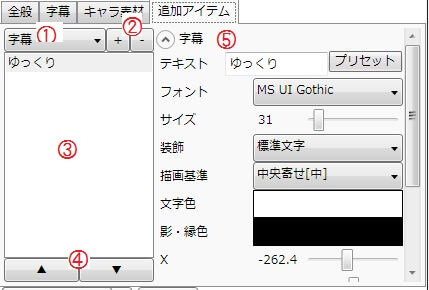

ゆっくりボイスと一緒に表示されるアイテムを設定します。  
追加アイテムを設定する事で、字幕の背景プレートやキャラクター名をセリフを喋っている時のみ表示させる事が出来るようになります。

## 1. 追加するアイテムの種類を選択
追加するアイテムの種類を選択します

## 2. 選択したアイテムを追加/削除
「+」：左のコンボボックスで選択したアイテムを追加します。  
「ｰ」：選択中のアイテムを削除します。

## 3. アイテムを選択
追加アイテムを選択します

## 4. 選択したアイテムを移動
選択したアイテムを上下に移動させます。

## 5. 選択中のアイテムを編集
選択中のアイテムを編集します。
各アイテムの設定項目に関しては「[アイテム編集](../editor/index.md)」を参照。