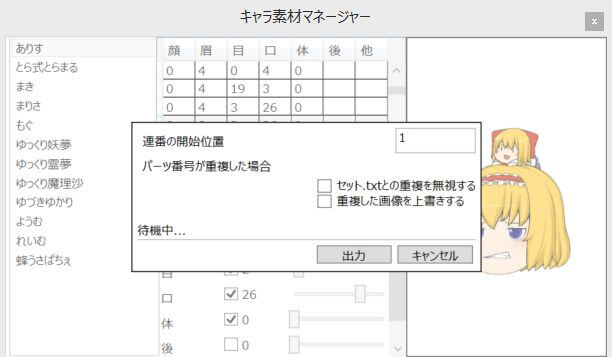

キャラ素材の「動く全」の設定や、非アニメーション「全」素材の出力が可能です。

## 左リスト
ゆっくりMovieMakerで認識しているキャラ素材一覧が表示されます。  
素材が表示されていない場合、  
設定→キャラ素材→全般→キャラ素材  
の設定を見直してください。

## 中央上の表
キャラ素材ver4から利用可能な「動く全」のパーツ組み合わせの一覧です。

## 中央左ボタン
### 追加
新しく「動く全」のパターンを追加します。

### コピーして追加
現在選択しているパターンをコピーし、新しく「動く全」のパターンを追加します。

### 削除
現在選択している「動く全」のパターンを削除します。

## 中央右のボタン
### 保存(セット.txt)
編集中のキャラ素材の表情一覧を保存します。

### 選択したアイテムを非アニメーション素材として出力
現在選択している「動く全」を「動かない全」として画像出力します。

### すべてのアイテムを非アニメーション素材として出力
追加されているすべての「動く全」を「動かない全」として画像出力します。

## 中央下
現在選択中の「動く全」の設定を変更します。

## 右プレビューエリア
現在選択中の表情をプレビューします。

## 非アニメーション素材出力

- 選択したアイテムを非アニメーション素材として出力
- すべてのアイテムを非アニメーション素材として出力

をクリックした際に表示されます。

### 連番の開始位置
ここで指定した番号で画像出力を開始します。  
「01」を指定し、  
「選択したアイテムを非アニメーション素材として出力」をクリックした場合は「01.png」を、  
「すべてのアイテムを非アニメーション素材として出力」をクリックした場合は「01.png」「02.png」「03.png」…と出力します。

### パーツが重複した場合
#### セット.txtとの重複を無視する
出力しようとする画像番号がすでに「セット.txt」で定義してある場合の処理を変更します。  
チェックが入っている場合、セット.txtで定義済みの番号にも画像を出力します。  
チェックが外れている場合、セット.txtで定義されていない番号まで番号をスキップします。

#### 重複した画像を上書きする
出力しようとした画像番号ですでに画像が出力されている場合の処理を変更します。  
チェックが入っている場合、画像を上書き保存します。  
チェックが外れている場合、画像が出力されていない番号まで番号をスキップします。

### 設定例
#### すべての「動く全」を非アニメーション素材に置き換える
ボタン：「すべてのアイテムを非アニメーション素材として出力」  
連番の開始位置：1  
セット.txtとの重複を無視する：ON  
重複した画像を上書きする：OFF  
セット.txtと非アニメーション全で番号が重複している場合、セット.txtの定義が優先されるため、動く全を非アニメーション素材に置き換える場合は「セット.txt」を「セット.txt.bac」等にリネームして無効化します。

#### すべての「動く全」と非アニメーション素材、両方使えるようにする
ボタン：「すべてのアイテムを非アニメーション素材として出力」  
連番の開始位置：1  
セット.txtとの重複を無視する：OFF  
重複した画像を上書きする：OFF

#### 出力済みの非アニメーション全を再出力する
ボタン：「選択したアイテムを非アニメーション素材として出力」  
連番の開始位置：出力済みの非アニメーション全パーツの番号  
セット.txtとの重複を無視する：ON  
重複した画像を上書きする：ON