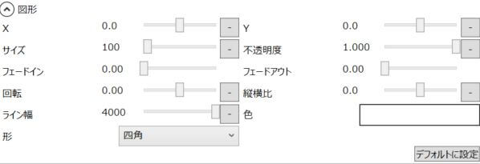

図形アイテムに関する設定が行えます。

## X
表示位置を指定します。

## Y
表示位置を指定します。

## サイズ
図形のサイズを指定します。

## 不透明度
図形の不透明度を指定します。

## フェードイン
フェードインにかかる秒数を指定します。

## フェードアウト
フェードアウトにかかる秒数を指定します。

## 回転
図形の回転角を指定します。

## 縦横比
図形の縦横比を指定します。

## ライン幅
図形のライン幅を指定します。

## 色
図形の色を指定します。

## 形
図形の形を指定します。