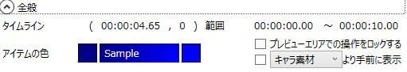

全てのアイテムに共通するプロパティの設定です。

## タイムライン
タイムライン上の表示位置です。

## 範囲
アイテムの再生範囲です。

## アイテムの色
タイムライン上の表示色です。
キャラクター関連のアイテムの場合、アイテムの色はキャラクター毎に設定されます。

## プレビューエリアでの操作をロックする
ここにチェックを入れると、プレビューエリア上から「表示位置の変更」「サイズの変更」「回転角の変更」ができなくなります。

## 「追加アイテム/キャラ素材/字幕」より手前に表示
ここにチェックを入れると、現在のアイテムを選択した表示位置より手前に表示されるようになります。