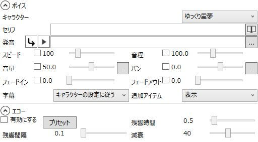

ゆっくりボイスやそれに関するアイテムの設定です。

## ボイス
ゆっくりボイスに関する設定を行います。

### キャラクター
ここで選択したキャラクターが喋ります。

### セリフ
字幕やタイムライン上での表示用のテキストを入力します。  
Shift+Enterキーでセリフを改行可能です。

### セリフ→発音変換ボタン
セリフで入力した内容を音声合成エンジンが認識可能な形式に変換します。

### 辞書登録ボタン
辞書ウィンドウを表示します。  
この時、「セリフ」欄でテキストを選択していた場合、辞書ウィンドウの単語欄に、選択したテキストが入力された状態でウィンドウが開きます。

### プレビュー再生ボタン
現在の設定でプレビューを再生します。

### 発音
#### 通常のゆっくりボイス
実際に発音するテキストを入力します。  
選択している音声合成エンジンが読み上げ出来ないテキストを入力した場合、自動的にテキストが変換されます。

- [アクセントを付ける](../../tips/yukkuri/h201341985816853.md)
- [ボーカロイドに喋らせる](../../tips/yukkuri/h2013422234958360.md)
- [UTAUに喋らせる](../../tips/yukkuri/h201422514303591.md)

#### カスタムボイス
ゆっくりMovieMakerが対応していない音声合成エンジンを利用し、各種アイテム（字幕やキャラ素材）との連携を行いたい時はこれを利用します。  
発音欄に各種合成エンジンで出力したwavファイルやmp3ファイルをドラッグ＆ドロップすると、そのファイルをゆっくりボイスとして扱います。  
この時ドロップしたファイルと同名のtxtファイルが存在した場合、その内容を「セリフ」欄に貼り付けます。  
このため[VOICEROID+](https://www.amazon.co.jp/s?k=VOICEROID%2B&_encoding=UTF8&camp=247&creative=7399&linkCode=ur2&tag=manjubox-22)のようなwavファイル出力時にセリフテキストをtxtファイル出力する音声合成エンジンとスムーズに連携を取る事が可能です。

- [VOICEROID+を利用する](../../tips/yukkuri/h201342223491450.md)

カスタムボイスを利用すると、「スピード」「音程」「エコー」の項目は音声に反映されません。注意してください。

### カスタムボイス選択ボタン
カスタムボイスに使用するwav/mp3ファイルを選択します。  
カスタムボイスに関しては「発音」の項目を参照。

### スピード
ゆっくりボイスの喋るスピードを設定します。

### 音程
ゆっくりボイスの音程を設定します。  
この数値を変更すると、音声の再生速度も変化してしまう点に注意してください。  
再生速度を維持したまま音程を変化させたい場合、音程の増加分スピードを減少させてください。  
（例：音程100→120　スピード100→80）

### 音量
ゆっくりボイスの音量を設定します。

### パン
ゆっくりボイスのパンを設定します。  
ここの数値がマイナスの場合は音声が左側から聞こえ、プラスの場合は右から聞こえてきます。

### フェードイン
フェードインにかかる秒数を設定します。

### フェードアウト
フェードアウトにかかる秒数を設定します。

### 字幕
現在のゆっくりボイスにセリフを表示させるかどうかの設定を行います。

#### キャラクターの設定に従う
現在のキャラクターに設定されている字幕の設定に従います。  
キャラクター側で字幕を表示する設定にしている時にのみ字幕が表示されます。

#### 表示
キャラクター側で字幕を表示するようにしているか否かにかかわらず、強制的に字幕を表示させます。  
この時、表示される字幕の設定（フォントや表示位置等）はキャラクター側の設定を利用します。

#### 非表示
強制的に字幕を非表示にします。

#### 個別に設定する
現在のボイス固有の設定で字幕を表示します。  
この設定を選択している時のみ、ゆっくりボイスのアイテム編集ウィンドウに「字幕」の項目が表示されます。

### 追加アイテム
追加アイテムを表示するかどうかを設定します。

## エコー
ゆっくりボイスに適用するエコーエフェクトを設定します。

### エコーを有効にする
エコーを有効にするか否かを設定します。

### プリセット
エコーのプリセットが格納されています。  
「エコー」「やまびこ」のプリセットが利用可能です。

### 残響時間
残響音の効果時間を設定します。  
ここで設定した数値分、ゆっくりボイスの長さが増加します。

### 残響間隔
残響音がどれくらいの間隔で響くかを設定します。

### 減衰
残響音が鳴るたびにどれくらい音が減衰するかを設定します。

## 字幕
ボイス→字幕で「個別に設定する」が選択されている時のみ表示されます。  
この項目の各種設定に関しては「[字幕](h201341914151668.md)」のページを参照。

## キャラ素材
キャラ素材の表情を設定します。  
この項目の各種設定に関しては「[キャラ素材表情アイテム](h2013419141533737.md)」を参照。  
また、この項目を設定するだけではキャラ素材は表示されません。  
キャラ素材を表示する方法は「[キャラ素材を表示する](../../tutorial/editing/h201341985852761.md)」の項目を参照。  
**キャラクターの「素材名」が空白の場合、この項目は表示されません。**
