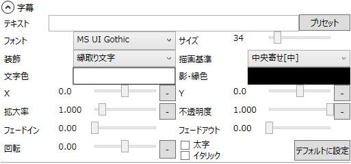
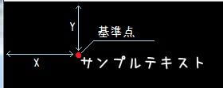

字幕に関する設定が行えます。

## テキスト
表示する字幕のテキストを設定します。  
Shift+Enterで改行が可能です。

## プリセット
字幕の表示位置(X/Y/描画基準)を設定します。

## フォント
フォントを設定します。

## サイズ
字幕のテキストサイズを設定します。

## 装飾
字幕の装飾を設定します。

### 標準文字
文字に装飾を行いません。  
字幕の背景にテキスト用のプレートを付けない場合、非常に可読性が悪くなります。  
影付文字/縁取り文字を利用するか、「[追加アイテム](/ymm3/help/charactereditor/h2013419141621231/)」を利用するなどして、字幕の背景に画像を表示させましょう。

### 影付文字(通常/薄)
字幕の影を付けます。

### 縁取り文字(通常/薄)
字幕を縁取りします。

### ソフトシャドー（濃/通常/薄）
字幕に柔らかい影をつけます。

## 描画基準

X/Yで指定された基準点に対し、どのようにテキストを描画するのかを指定します。（画像は左寄せ[上]の場合）

### 左寄せ
テキストの左端に基準点が来るように描画します。
### 中央寄せ
テキスト中央に基準点が来るように描画します。
### 右寄せ
テキストの右端に基準点が来るように描画します。

### [上]
テキスト上部に基準点が来るように描画します。
### [中]
テキスト中部に基準点が来るように描画します。
### [下]
テキスト下部に基準点が来るように描画します。

### 縦書き
テキストを縦書きにします。

## 文字色
字幕テキストの色を指定します。

## 影･縁色
装飾「影」「縁取り」の色を指定します。

## X
字幕の表示位置を指定します。

## Y
字幕の表示位置を指定します。

## 拡大率
字幕の表示倍率を指定します。

## 不透明度
字幕の不透明度を指定します。

## フェードイン
フェードインにかかる秒数を指定します。

## フェードアウト
フェードアウトにかかる秒数を指定します。

## 字間(プレビュー非対応)
文字同士のスペースの大きさを指定します。

## 行間(プレビュー非対応)
行同士のスペースの大きさを指定します。

## 回転
字幕の回転角度を指定します。

## 太字
字幕を太字にするかどうかを指定します。

## イタリック
字幕を斜体にするかどうかを指定します。

## 高精度モード/等間隔モード/滑らかにする(プレビュー非対応)
AviUtl上でのテキストの表示を変更します。

## デフォルトに設定
このボタンをクリックすると、現在の設定が字幕のデフォルト設定になります。