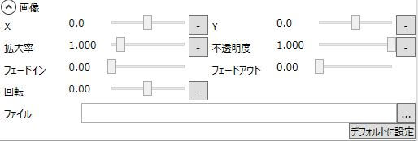

画像アイテムに関する設定が行えます。

## X
表示位置を指定します。

## Y
表示位置を指定します。

## 拡大率
表示倍率を指定します。

## 不透明度
不透明度を指定します。

## フェードイン
フェードインにかかる秒数を指定します。

## フェードアウト
フェードアウトにかかる秒数を指定します。

## 回転
回転角度を指定します。

## ファイル
画像ファイルを指定します。

## デフォルトに設定
現在のアイテムを画像アイテムのデフォルトに設定します。
