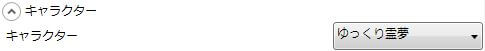
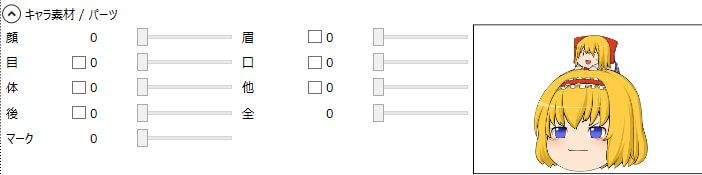
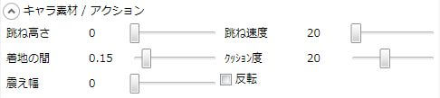
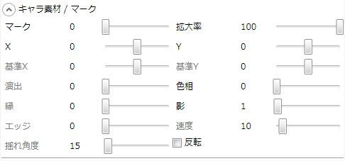

## キャラクター

現在のキャラクターを指定します。

## キャラ素材/パーツ

表情の各パーツを指定します。

### 顔
顔色を指定します。

### 眉
眉を指定します。

### 目
目を指定します。
素材によってアニメーションする物があります。

### 口
口を指定します。
素材によってアニメーションする物があります。

### 体
体を指定します。

### 他
その他のパーツを指定します。  
素材によってアニメーションする物があります。

### 後
キャラクターの後ろに表示されるパーツを指定します。  
素材によってアニメーションする物があります。

### 全
あらかじめ作成された表情のセットを指定します。  
ここの数値を0以外に指定すると、「顔」や「目」といったパーツは全て無視されます。

### マーク
クエスチョンマーク等のマークを表示します。

## キャラ素材/アクション

キャラ素材のアクションを指定します。

### 跳ね高さ
ここで指定した数値分、その場で飛び跳ねます。

### 跳ね速度
その場で飛び跳ねる速度を指定します。

### 着地の間
跳ねと跳ねとの間を指定します。

### クッション度
着地時、キャラクターがどの位ひしゃげるかを指定します。

### 震え幅
ここで指定した数値分、ランダム濃厚に震えます。

### 反転
キャラ素材を反転させます。

## キャラ素材/マーク

マークに関する各種設定が行えます。

### マーク
マークを選択します。

### 拡大率
拡大率を指定します。

### X
表示位置を指定します。  
この座標はキャラ素材との相対座標です。

### Y
表示位置を指定します。  
この座標はキャラ素材との相対座標です。

### 基準X
演出の基準位置を指定します。  
この座標はキャラ素材との相対座標です。

### 基準Y
演出の基準位置を指定します。  
この座標はキャラ素材との相対座標です。

### 演出
マークの演出を指定します。

1. 拡大登場
2. 伸縮登場
3. 繰り返し拡大
4. 繰り返し放出
5. 振り子
6. 起点付き鼓動

### 色相
マークの色相を指定します。

### 縁
マークを縁取りします。

### 影
マークに影を付けます。

### エッジ
マークのエッジ強度を指定します。

### 速度
演出の速度を指定します。

### 揺れ角度
マーク演出「5:振り子」の揺れる角度を指定します。

### 反転
マークを反転させます。