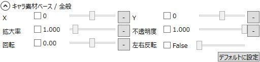
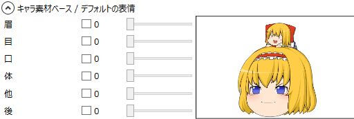
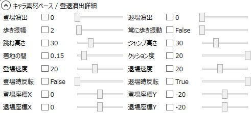
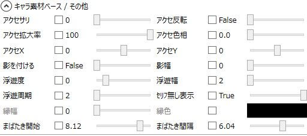

## キャラ素材ベース / 全般

キャラ素材ベースアイテムの基本的な設定を行います。

### X
キャラ素材の表示位置を指定します。

### Y
キャラ素材の表示位置を指定します。

### 拡大率
キャラ素材の拡大率を指定します。

### 不透明度
キャラ素材の不透明度を指定します。

### 回転
キャラ素材の回転角度を指定します。

### 左右反転
キャラ素材を左右反転させます。

## キャラ素材ベース / デフォルトの表情

デフォルトの表情を指定します。

### 眉
デフォルトの眉パーツを指定します。

### 目
デフォルトの目パーツを指定します。  
使用する素材によってはアニメーションする物もあります。

### 口
デフォルトの口パーツを指定します。

### 体
デフォルトの体パーツを指定します。

### 他
デフォルトの他パーツを指定します。  
使用する素材によってはアニメーションするの物あります。

### 後
デフォルトの後パーツを指定します。  
使用する素材によってはアニメーションする物もあります。

## キャラ素材ベース / 登退演出詳細

登場演出/退場演出の詳細設定を行います。

### 登場演出
登場時の演出を指定します。

1. フェードイン
2. ジャンプ
3. 伸縮ジャンプ
4. 変身
5. 歩いて移動
6. 跳ねて移動

### 退場演出
退場時の演出を指定します。

1. フェードアウト
2. ジャンプ
3. 伸縮ジャンプ
4. 変身
5. 歩いて移動
6. 跳ねて移動

### 歩き歩幅
登退演出「5:歩いて移動」の歩幅を指定します。

### 常に歩き振動
常に歩いているかのように振動するかどうかを指定します。

### 跳ねた高さ
登退演出「6:跳ねて移動」の跳ねる高さを指定します。

### ジャンプ高さ
登退演出「2:ジャンプ」のジャンプする高さを指定します。

### 着地の間
登退演出「6:跳ねて移動」の着地の間を指定します。

### クッション度
登退演出「6:跳ねて移動」のクッション度を指定します。

### 登場速度
登場する速度を指定します。

### 退場速度
退場する速度を指定します。

### 登場時反転
登場時に反転するかどうかを指定します。

### 退場時反転
退場時に反転するかどうかを指定します。

### 登場座標X
登場元の相対座標を指定します。
実際の登場開始地点はここで指定した数値の3倍の地点からになります。

### 登場座標Y
登場元の相対座標を指定します。
実際の登場開始地点はここで指定した数値の3倍の地点からになります。

### 退場座標X
退場先の相対座標を指定します。
実際の退場先地点はここで指定した数値の3倍の地点になります。

### 退場座標Y
退場先の相対座標を指定します。
実際の退場先地点はここで指定した数値の3倍の地点になります。

## キャラ素材ベース / その他

その他の設定を行います。

### アクセサリ
アクセサリを指定します。

### アクセ反転
アクセサリを反転するかどうかを指定します。

### アクセ拡大率
アクセサリの拡大率を指定します。

### アクセ色相
アクセサリの色相を指定します。

### アクセX
アクセサリの表示位置を相対座標で指定します。

### アクセY
アクセサリの表示位置を相対座標で指定します。

### 影を付ける
地面に影を付けます。

### 影幅
壁に影を付けます。

### 浮遊度
キャラクターの浮遊度を指定します。  
ここの数値を6以上にするとキャラクターがフワフワと浮遊します。  
また、素材によってはそれに合わせてアニメーションが発生します。

### 浮遊幅
浮遊度が6以上に設定されている時、ここで指定されている幅でフワフワと浮きます。

### 浮遊周期
浮遊度が6以上に設定されている時、ここで指定されている周期でフワフワと浮きます。

### セリフ無し表示
キャラクターが喋っていない時にもキャラ素材を表示するかどうかを指定します。

### 縁幅
キャラ素材を縁取る太さを指定します。

### 縁色
キャラ素材を縁取る色を指定します。

### まばたき開始
まばたきアニメーションを開始する秒数を指定します。

### まばたき間隔
まばたきアニメーションの間隔を指定します。