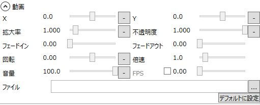

動画に関する設定が行えます。

## X
表示位置を設定します。

## Y
表示位置を設定します。

## 拡大率
表示倍率を設定します。

## 不透明度
不透明度を設定します。

## フェードイン
フェードインにかかる秒数を設定します。

## フェードアウト
フェードアウトにかかる秒数を設定します。

## 回転
回転角度を設定します。

## 倍速
再生速度を設定します。
0倍速に設定することで、動画を一時停止することが可能です。

## 音量
音量を設定します。

## FPS
exo出力時に使用するFPSの値を指定します。
基本的にはデフォルトの数値を使用し、自動取得されるFPSに誤りがある場合に利用して下さい。
通常はデフォルトの数値を利用してください。

## ファイル
動画ファイルを設定します。

## デフォルトに設定
現在の設定を動画のデフォルトに設定します。