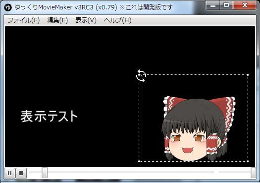

## プレビュー操作する
スペースキーを押すか、「再生/一時停止ボタン」をクリックするとプレビューの再生/一時停止の切り替えが可能です。  
音量を調節したい場合は音量調節バー、再生位置を調節したい場合はシークバーを利用します。  
各種ボタン、スライダーに関しては「[画面の説明]()」に記載してあります。

## プレビューからアイテムを操作する
プレビューから直接アイテムを操作する事が可能です。  
アイテムにカーソルを乗せるとリサイズ/回転用のUIが表示されます。  
対応アイテム：[字幕](../editor/h201341914151668.md) /[動画](../editor/h201341914156976.md) /[画像](../editor/h2013419141524833.md) / [キャラ素材](../editor/h2013419141542403.md)

### 表示位置を変更する
表示されているアイテムをドラッグ＆ドロップすると、アイテムの表示位置を変更する事が出来ます。

### 表示サイズを変更する
表示されているアイテム上でマウスホイールを回転させるとアイテムの表示位置を変更できます。

### 回転を変更する

アイテムの四隅にカーソルを乗せ、回転用のカーソルをドラッグ＆ドロップするとアイテムの回転を変更する事が出来ます。  
また、Shiftキーを押しながらマウスを移動させると、45度単位でアイテムが回転します。