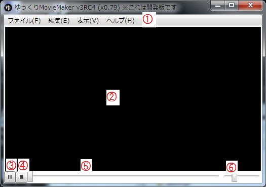

## 1. メニューバー
プロジェクトの読み込みや保存、設定やウィンドウの表示などがメニューに格納されています。  
詳細は「[メニュー](h201341914131331.md)」ページをご覧下さい。

## 2. プレビューエリア
プロジェクトのプレビューを表示します。  
詳細は「[プレビュー](h2013419141319788.md)」ページをご覧下さい。

## 3. 再生/一時停止ボタン
プレビューの再生/一時停止を切り替えます。  
スペースキーでも再生/一時停止の切り替えが可能。

## 4. 停止ボタン
プレビューを停止し、再生位置を00:00:00.00に戻します。

## 5. シークバー
プレビューの現在の再生位置を表示しています。

## 6. 音量調節スライダー
プレビューの現在の音量を表示しています。