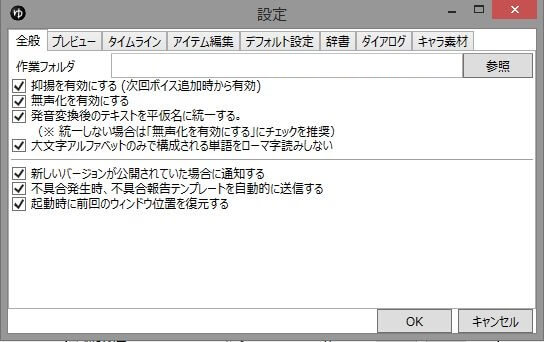

## 作業フォルダ
ゆっくりボイスや字幕の画像などを一時的に保存しておくフォルダを指定します。

## 抑揚を有効にする
チェックを入れると、ゆっくりボイス追加時に抑揚が付くようになります。

## 無声化を有効にする
ゆっくりMovieMaker側で無声化を行います。  
この項目を無効にした場合でもaquestalk側である程度自動的に無声化されます。  
「あくせさり」「～です。」等を「あ_クせさり」「～で_ス。」と発音するようになり、より発音が滑らかになります。

## 発音変換後のテキストをひらがなに統一する
チェックを入れると発音変換後のテキストがひらがなのみに。  
チェックを外すと発音変換後のテキストがひらがな・カタカナ混合になります。

## 大文字アルファベットのみで構成される単語をローマ字読みしない
チェックを入れると、「HP」や「MP」を「エイチピー」「エムピー」と発音するようになります。

## 新しいバージョンが公開された場合に通知する
チェックを入れると新しいバージョンが公開された際に通知します。  
この項目は有効にしておく事を推奨します。  
また、サポート掲示板では最新のバージョン以外はサポート対象外です。  
ご了承ください。

## 不具合発生時、不具合報告テンプレートを自動的に送信する
この項目と「新しいバージョンが公開された場合に通知する」の項目にチェックが入っている場合、不具合発生時に自動的に不具合報告テンプレートを送信します。

## 起動時に前回ウィンドウの位置を復元する
チェックを入れると、ソフト起動時に前回のウィンドウ位置・ウィンドウサイズを復元します。