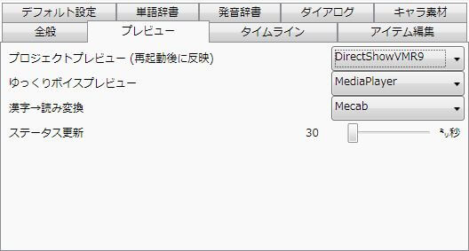

プレビューに関する設定を行えます。

## プロジェクトのプレビュー（再起動後に反映）
プロジェクトのプレビューに使用するプレイヤーを選択します。

### DirectShowVMR9
DirectShowを用いて動画を再生します。  
DirectShowEVRで再生できない動画を再生可能な場合があります。

### DirectShowEVR
DirectShowを用いて動画を再生します。  
DirectShowVMR9で再生できない動画を再生可能な場合があります。

### MediaElement(非推奨)
WMPを用いて動画を再生します。  
DirectShowを用いたプレビューで再生できなかった動画が再生可能になる可能性がありますが、プロジェクトのFPSと異なるFPSの動画ソースを使用した場合、音ズレが発生する可能性があります。  
動画アイテムのFPSの項目が「0」になっている場合、手動でFPSを設定する必要があります。

## ゆっくりボイスプレビュー
ゆっくりボイスのプレビューに使用するプレイヤーを選択します。

### MediaPlayer
通常はこちらを選択してください。

### MCI
MediaPlayerではゆっくりボイスを再生できない観光の場合にのみ使用してください。  
ゆっくりボイスのプレビューにMCIを選択すると、環境によっては「音量」「パン」の設定がプレビューに反映されなくなります。  
（exo出力には影響ありません。）

## 漢字→読み変換
漢字を含む文章を音声合成エンジンが読み取り可能なテキストに変換するのに使用するライブラリ/関数を選択します。

### Mecab_IPADic
Mecabを使用して漢字→読み変換を行います。  
**※ 追加ファイルのダウンロードが必要**

### IME再変換
IMEの再変換機能を使用して漢字→読み変換を行います。

### Mecab_Unidic
Mecabを使用して漢字→読み変換を行います。  
これを使用し、なおかつ「設定→全般→抑揚を有効にする」にチェックが入っている場合、ゆっくりボイスのセリフに自動で抑揚を付与します。  
**※ 追加ファイルのダウンロードが必要**

## ステータス更新
タイムラインのステータス更新の頻度を指定します。