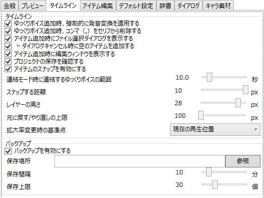

タイムラインに関連した設定が行えます。

## タイムライン
### ゆっくりボイス追加時、強制的に発音変換を適用する
タイムラインウィンドウ下部のテキストボックスからゆっくりボイスを追加した際、強制的にセリフ→発音への変換を行います。  
これにより、「こんにちは」等すべて平仮名orカタカナのテキストも正常に「こんにちわ」等へ変換されます。  
「きょ’うわ/いい+て’んきだ」等、予め発音記号を含めたテキストを入力する場合、この項目をオフにし、強制変換が行われないようにしてください。

### ゆっくりボイス追加時、コンマ（,）をセリフから削除する
タイムラインウィンドウ下部のテキストボックスからゆっくりボイスを追加した際、セリフからコンマ(,)を削除します。  
「長文を発音する際、このようにして,コンマをセリフに挟むことで,テキストの棒読み感を,緩和することができます。」  
とボイスを追加した際、字幕用のテキストにはコンマを削除した  
「長文を発音する際、このようにしてコンマをセリフに挟むことでテキストの棒読み感を緩和することができます。」  
が入力されます。

### アイテム追加時にファイル選択ダイアログを表示する
タイムラインにファイル系アイテムを追加した際、ファイル選択ダイアログを表示します。

### ダイアログキャンセル時に空のアイテムを追加する
ファイル系アイテム追加時のファイル選択ダイアログをキャンセルした際、空のアイテムを追加します。

### アイテム追加時に編集ウィンドウを表示する
タイムラインにアイテムを追加した際、アイテム編集ウィンドウを表示します。

### プロジェクトの保存を確認する
ソフト終了時・プロジェクトの新規作成時、現在開いているプロジェクトが保存されていない場合に保存するかどうかを確認するダイアログを表示します。

### アイテムのスナップを有効にする
有効にするとアイテム同士がスナップするようになります。

### 連結モード時に連結するゆっくりボイスの範囲
ゆっくりボイスの追加モードが「結（連結）」モード時、同一レイヤーかつ指定範囲内のゆっくりボイスを連結します。
0：範囲無限

### スナップする距離
アイテム同士がスナップする距離を設定します。

### レイヤーの高さ
タイムラインのレイヤーの高さを指定します。

### 元に戻す/やり直しの上限
作業履歴を何件まで保持しておくかの上限を設定します。

### 拡大変更時の基準点
拡大率変更時に行う表示位置補正の基準点を指定します。

#### 現在の再生位置
再生位置を基準に表示位置の補正を行います。

#### 現在の表示位置
タイムラインのオフセットを基準に表示位置の補正を行います。

## バックアップ
### バックアップを有効にする
有効にすると定期的にプロジェクトのバックアップを行います。

### 保存場所
バックアップの保存場所を指定します。

### 保存間隔
バックアップの保存間隔を指定します。

### 保存上限
バックアップの保存上限を指定します。