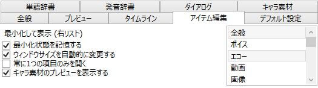

アイテム編集ウィンドウの各種設定が行えます。

## 最小化して表示
最小化したい各種項目を右のリストから選択します。

## 最小化状態を記憶する
アイテム編集ウィンドウ側で項目が開かれた/最小化された時にその状態を記憶します。

## ウィンドウサイズを自動的に変更する
アイテム編集ウィンドウの各項目を開く/最小化毎に、ウィンドウのサイズを調節します。

## 常に一つの項目のみを開く
一つの項目を開いたらその他の項目を最小化します。

## キャラ素材のプレビューを表示する
キャラ素材のプレビューを表示する可動をか設定します。