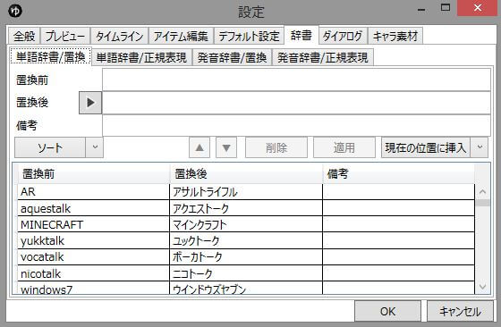

ゆっくりボイスの辞書設定が可能です。

## 単語辞書/発音辞書
### 単語辞書
ゆっくりボイスの発音を単語辞書の内容で置換します。

### 発音辞書
ゆっくりボイスの発音を発音辞書の内容で置換します。
この辞書は「設定→全般→抑揚を有効にする」にチェックが入っている場合にのみ有効になります。

## 置換/正規表現
### 置換
単語を単純に置き換えます。

### 正規表現
正規表現を用いて単語を置換します。
正規表現を用いて複雑な置換を行う事が可能です。

## 各辞書の適用順
各種辞書は以下の順番/タイミングで適用されています。

1. 変換が必要かどうかをチェック
1. テキストの正規化
    1. 半角カタカナ→全角カタカナ
    1. 全角英字→半角英字
    1. 全角数字→半角数字
    1. タグ付き数字のタグを外す
    1. 改行を削除
1. 単語辞書を適用
1. 単語辞書（正規表現）を適用
1. 音声生成エンジンが漢字に対応していない場合、漢字→ひらがな・カタカナ
1. 音声生成エンジンがアルファベットに対応していない場合、アルファベット→カタカナ
1. 音声生成エンジンが数字に対応していない場合、数字→カタカナ
1. 音声生成エンジンがAquesTalkの場合、数字にタグを付ける
1. 音声生成エンジンがひらがな/カタカナに対応している場合、特殊な読みのひらがな/カタカナを正規化
1. 音声生成エンジンがひらがな/カタカナに対応していない場合、ひらがな/カタカナ→アルファベット
1. 非対応文字を削除
1. 非対応文字を削除
1. 不正な撥音を削除
1. 不正な拗音を大文字に
1. 抑揚がONの場合、抑揚を正規化
1. 抑揚がONの場合、発音辞書→発音辞書（正規表現）を適用
1. 非対応文字を削除（2回目）

## 置換前/置換後
置換前・置換後のテキストを指定します。

## 備考
コメントを記入できます。

## ソート
現在の辞書を「置換前」の文字数でソートします。

## インポート
.dic形式(YMM2/棒読みちゃん用)の辞書ファイルをインポートします。

## エクスポート
.dic形式(YMM2互換)の辞書ファイルをエクスポートします。

## 重複を削除
重複した単語を削除します。

## クリア
現在の辞書をクリアします。

## ▲/▼
選択した単語を並び替えます。

## 削除
選択した単語を削除します。

## 適用
選択した単語に設定を適用します。

## 現在の位置に挿入/先頭に追加/末尾に追加
新しく単語を指定した位置に追加します。