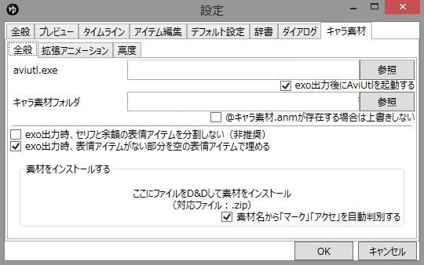

キャラ素材に関する各種設定が行えます。

## 全般
### aviutl.exe
aviutl.exeのパスを指定します。  
キャラ素材を使用する場合、使用するaviutl.exeのパスを指定しないとAviUtlで正常にexoファイルが読み込めません。

### exo出力時にAviUtlを起動する
exo出力時、aviutlを自動的に起動するかどうかを設定します。

### キャラ素材フォルダ
キャラ素材を保存しているフォルダを指定します。  
詳細は「[キャラ素材を使用する準備をする](/ymm3/tutorial/charasozai/)」を参照。

### @キャラ素材.anmが存在する場合は上書きしない
チェックを入れると指定したaviutl.exeに「@キャラ素材.anm」が存在する場合にスクリプトを上書きしなくなります。  
特殊な用途以外ではチェックを入れないでください。

### exo出力時、セリフと余韻の表情アイテムを分割しない（非推奨）
この項目にチェックを入れると、  
・「セリフ無し表示」をOFFにしている場合でも、セリフの余韻部分でキャラクターが表示されるようになります。  
・セリフの余韻部分でもマークの演出が表示されるようになります。  
ただし、このオプションを有効にした場合、セリフの余韻部分で別のキャラクターにしゃべらせると、そのキャラクターにつられて口パクするor高速で口パクする場合があります。  

### exo出力時、表情アイテムがない部分を空の表情アイテムで埋める（推奨）
セリフや表情アイテムのない部分を空の表情アイテムで埋めます。

### 素材をインストールする
ダウンロードしたキャラ素材のzipファイルを枠内にD&Dすると、自動的にキャラ素材が「キャラ素材フォルダ」に配置されます。

### 素材名から「マーク」「アクセ」を自動判定する
素材名に「マーク」「アクセ」を含む素材（「○○式マーク」「アクセサリ素材」等）を自動的に「マーク」「アクセサリ」素材として扱います。

## 拡張アニメーション
### 文字
アニメーションを識別する文字

### パーツ
アニメーションするパーツ

### アニメーション
アニメーションのタイプ

### 開始（秒）
アニメーションの開始タイミング

### 間隔（秒）
アニメーションの間隔

### 時間（秒）
アニメーションの時間

### 中間割合
往復アニメーションの中間の割合  
（例：abcde-ee-edcbaなら-ee-の部分で2）  

## 高度
### 動画素材フォルダ
動画素材のフォルダを指定します。  
キャラ素材スクリプトの立ち絵を使用しない場合は指定する必要はありません。  
※「立ち絵」は「キャラ素材」とは異なります。  

### 挿絵フォルダ
挿絵のフォルダを指定します。  
キャラ素材スクリプトの立ち絵を使用しない場合は指定する必要はありません。  
※「立ち絵」は「キャラ素材」とは異なります。  

### 音量ボーダー
口パク時の口の開き具合を調節します。

### 目パチ時間
まばたきにかかる時間を指定します。

### 口パク速度
口パクの速度を指定します。  
ここで指定した数値(FPS)でアニメーションしますが、数値を上げすぎても逆に不自然なアニメーションになります。  
※ゆっくりMovieMaker側のプレビューには反映されません。  