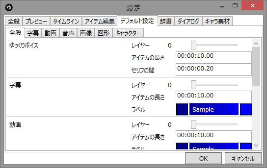

各種アイテムのデフォルト設定が行えます。

## 全般
### レイヤー
アイテムを追加するレイヤーを指定します。  
指定したレイヤーに追加できない場合、一つ上のレイヤーに追加を試みます。

### アイテムの長さ
デフォルトのアイテムの長さを指定します。

### ラベル
デフォルトのアイテムの色を指定します。

### セリフの間
ゆっくりボイスのみ。  
セリフの後に空白の期間を設定します。

## 各種アイテム
各種アイテムのデフォルト設定を指定します。  
各項目に関しては「[字幕](../editor/h201341914151668.md)」「[動画](../editor/h201341914156976.md)」「[音声](../editor/h2013419141518496.md)」「[画像](../editor/h2013419141524833.md)」「[図形](../editor/h20131227175344965.md)」を参照。

## キャラクター
キャラクターのデフォルト設定（キャラクターの新規追加時に使用）を設定します。  
各項目に関しては「[キャラクター編集](../charactereditor/index.md)」を参照。