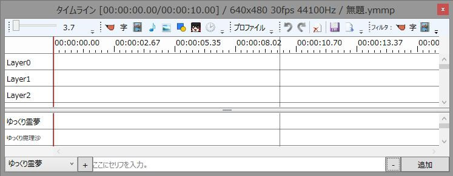

## タイトルバー
タイムラインの各種情報が表示されています。

- 現在の再生位置 (00:00:00.00)
- タイムラインの長さ (00:00:10.00)
- 現在のプロファイルの設定 (640×360 30fps 44100Hz)
    - 画面の大きさ (640×360)
    - フレームレート (30fps)
    - オーディオレート (44100Hz)
- 現在のプロジェクトファイル名（無題.ymmp）
- タイムラインが保存されているかどうか (*)
- 出力済みのexoファイル名(無題.exo / exo出力後に表示)

## exo出力後にタイムラインに変更が加えられたかどうか(*/ exo出力後に表示)
各種ツールバー
タイムラインやプロジェクトに関する各種機能が格納されています。
詳しい機能は「[ツールバー](./h2013419141345752.md)」を参照。

## タイムライン
プロジェクトのタイムラインを編集できます。
詳しい機能は「[タイムライン](./h2013419141356897.md)」を参照。

## キャラ素材専用タイムライン
キャラ素材専用のタイムラインです。
詳しい機能は「[キャラ素材専用タイムライン](./h2013419141422394.md)」を参照。

## ゆっくりボイス追加エリア
ゆっくりボイスを追加するために使用します。
詳しい機能は「[ゆっくりボイス追加エリア](./h2013419141433260.md)」を参照。