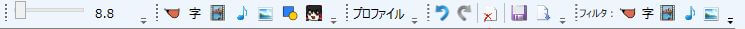

タイムラインやプロジェクトに関する各種機能が格納してあります。

## タイムライン拡大率調節スライダー
タイムラインの拡大率を変更します。

## 各種アイテム追加ボタン
各種アイテムを追加できます。

### ゆっくりボイス
[ゆっくりボイス追加エリア](/ymm3/help/timeline/h2013419141433260/)で選択されているキャラクターのボイスを追加します。

### 字幕/図形
設定→デフォルト設定に設定されている内容でアイテムが追加されます。

### 動画/音声/画像アイテム
設定→デフォルト設定に設定されている内容でアイテムが追加されます。
「設定→タイムライン→アイテム追加時にファイル選択ダイアログを表示する」にチェックが入っていると、ファイル系アイテムの追加時にダイアログが表示されます。

### ゆっくりボイス/キャラ素材表情アイテム
また、キャラ素材表情アイテムを追加する際、キャラ素材専用タイムラインにキャラ素材ベースアイテムが追加されていないと素材が表示されないので注意してください。
詳細は「[キャラ素材を表示する](/ymm3/tutorial/editing/h201341985852761/)」をご覧下さい。

## プロファイル変更ボタン
動画のプロファイルを変更できます。
プロファイルからは、以下の項目が変更可能です。

- 動画の画面サイズ (640×360等)
- フレームレート (30FPS等)
- オーディオレート (44100Hz等)

## タイムライン操作ボタン
タイムラインの各種操作が可能です

### 元に戻す (Ctrl+Z)
編集を一つ前の状態に戻します。

### やり直し (Ctrl+Shift+Z)
実行した「元に戻す」を取り消します。

### 選択アイテムを削除 (Delete)
現在選択しているアイテムを削除します。

### プロジェクトを保存 (Ctrl+S)
現在のプロジェクトを保存します。
既にファイルとして保存してある場合、ファイルが上書きされます。

### .exo出力 (Ctrl+E)
作成したプロジェクトをAviUtlで読み込み可能な.exoに変換して出力します。

## 各種アイテムフィルターボタン
各種アイテムをフィルタリングし、アイテム毎に非表示に出来ます。
ゆっくりボイス関連のアイテムをフィルタリングした場合、ゆっくりボイス及びそれに関連したアイテム（字幕/キャラ素材/追加アイテム）も表示されなくなります。