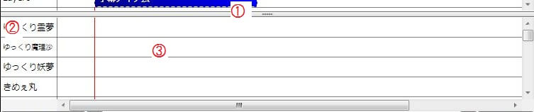

## 1, タイムラインとキャラ素材専用タイムラインとの間のつまみ
キャラ素材専用タイムラインの高さを変更できます。

## 2, キャラクター
タイムラインのキャラクターを表示します。  
表示をクリックすると、キャラクター毎に表示/非表示を切り替える事が出来ます。

## 3, キャラ素材専用タイムライン
キャラ素材ベースアイテム専用のタイムラインです。  
キャラクター毎に一つタイムラインが存在し、ここにアイテムが追加されていないとキャラ素材が表示されません。  
詳細は「[キャラ素材を表示する](../../tutorial/editing/h201341985852761.md)」をご覧下さい。  

### タイムライン上で右クリック
キャラ素材ベースアイテムを追加します。  
キャラ素材ベースアイテムでタイムライン上のキャラ素材の表示位置を指定し、表情アイテムで各種表情やアクションを指定します。  
タイムラインにベースアイテムを追加せず、表情アイテムのみを追加してもキャラ素材は表示されないので注意してください。  

#### アイテムを追加
レイヤーにキャラ素材ベースアイテムを追加します。

#### 塗りつぶし
レイヤーいっぱいに塗りつぶすようにキャラ素材ベースアイテムを追加します。

#### 現在の位置から塗りつぶし
現在の位置から右に塗りつぶすようにキャラ素材ベースアイテムを追加します。

#### 再生位置から塗りつぶし
現在の再生位置から右に塗りつぶすようにキャラ素材ベースアイテムを追加します。

### アイテム上で右クリック
#### 編集 (E)
編集ウィンドウを表示します。

#### 現在の位置で分割
アイテムを現在の位置で分割します。

#### 再生位置で分割
アイテムを現在の再生位置で分割します。

#### 削除 (D)
アイテムを削除します。

### アイテムの選択
#### クリック
アイテム単体を選択します。

#### Ctrl+クリック
複数のアイテムを選択します。

#### Shift+クリック

複数のアイテムをまとめて選択します。

#### Ctrl+A
タイムライン上の全てのアイテムを選択します。

### アイテムの移動
選択したアイテムをドラッグ＆ドロップすると、タイムライン上の位置を変更する事が出来ます。  
また、「設定→タイムライン→アイテムのスナップを有効にする」にチェックが入ってい場合、アイテム同士が吸着するようになります。  
吸着する距離を変更したい場合、「設定→タイムライン→スナップする距離」を変更してください。  

### アイテムの長さを変更
アイテムの両端にマウスを移動させ、カーソルが左右矢印に変化した状態でドラッグ＆ドロップすると、アイテムの長さを変更する事が出来ます。

### アイテムの削除
選択したアイテムを削除したい場合、アイテムを選択している状態でDeleteキーを押すか、アイテムを右クリックし、削除を選択します。