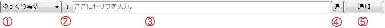

## 1. キャラクター選択コンボボックス
キャラクターを選択します。 ここで選択されたキャラクターで「ゆっくりボイス」「キャラ素材表情アイテム」を追加します。

## 2. キャラクター編集ウィンドウ表示ボタン
キャラクター編集ウィンドを表示します。

## 3. セリフ入力エリア
### 通常のゆっくりボイス
追加するゆっくりボイスのセリフを入力します。  
Shift＋Enterキーを押すと、複数行のセリフを入力することが出来ます。

### カスタムボイス
ゆっくりMovieMaker3では扱えない音声合成エンジンが出力した音声ファイルも扱う事が出来ます。  
各種音声合成エンジンで出力したをファイルをセリフ入力エリアにドラッグ＆ドロップすると、ファイルのパスが表示され、Enterキーを押すか、「追加」ボタンを押すと、指定したファイルをゆっくりボイスとして扱う事が出来ます。

また、この時ドラッグ＆ドロップしたファイルと同名の.txtファイルが存在した場合、「セリフ」欄に同名txtファイルの中身が入力されます。  
wavファイルと同時にセリフが記入されたtxtファイルを出力する音声合成エンジン(AHSのVOICEROID+等)を使用した場合、wavファイルをドラッグ＆ドロップするだけで、字幕用のテキストも同時に読み込む事が出来ます。  
- [VOICEROID+を使用する](../../tips/yukkuri/h201342223491450.md)

## 4. ゆっくりボイス追加モード変更ボタン
クリックするとゆっくりボイスの追加モードが切り替わります。

### 「-」ノンアシストモード
特にこれといったアシストを行いません。

### 「追」追記モード
ゆっくりボイス追加時、追加したボイスの末尾までシークします。  
連続したゆっくりボイスの追加が可能です。

### 「結」連結モード
ゆっくりボイス追加時、同じレイヤーに追加済みのゆっくりボイスを延伸し、連結します。  
連結するボイスの範囲は「設定→タイムライン→連結モード時に連結するゆっくりボイスの範囲」から設定できます。

## 5. ゆっくりボイス追加ボタン
「キャラクター選択コンボボックス」で選択したキャラクターの、「セリフ入力エリア」で入力されたセリフをタイムラインに追加します。