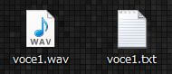
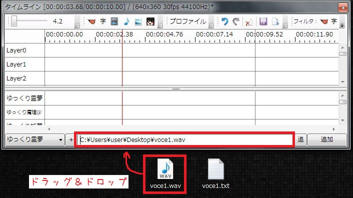

## ボイスロイドを使用する場合
[VOICEROID](https://www.amazon.co.jp/s?k=VOICEROID&_encoding=UTF8&camp=247&creative=7399&linkCode=ur2&tag=manjubox-22)を使用する場合、比較的簡単にボイス・字幕の追加が可能です。

VOICEROIDでセリフを保存すると、wavファイル＋同名のtxtファイルが出力されます。

出力されたwavファイルを「ここにセリフを入力」欄にドラッグ＆ドロップし、「追加」ボタンをクリックするとwavファイルをゆっくりボイスとして追加できます。  
この時「セリフ」欄にwavファイルと同名のtxtファイルの中身が入力されるので、wavファイルを取り込むだけで字幕を表示する事が出来ます。

## カスタムボイスのパスを設定する（応用）
キャラクター編集ウィンドウから「カスタムボイスのパス」を設定することで、wav/mp3ファイルのD&D時に自動的にカスタムボイスとしてファイルを追加することができるようになります。  
「結月ゆかり」の「カスタムボイスのパス」に「yukari」と設定した場合、「yukari01.wav」「yukari02.wav」等のファイルをタイムラインにD&Dする時、自動的に「結月ゆかり」のカスタムボイスとしてファイルを追加します。

<VOICEROIDCards limit="5"/>