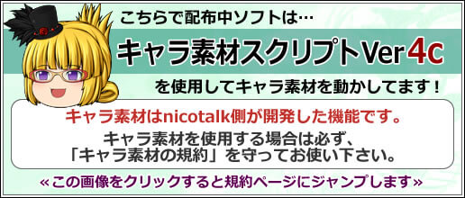

## キャラ素材とは
事前に設定を行うだけで、セリフに合わせて自動的に口パク・瞬きをする立ち絵「キャラ素材」を表示することが出来ます。  
事前設定に関しては、「[キャラ素材を使用する準備をする](/ymm3/tutorial/charasozai/)」及び「[キャラ素材を表示する](/ymm3/tutorial/editing/h201341985852761/)」を御覧ください。  
また、キャラ素材を使用する上で何かトラブルが発生した場合、「[よくある質問/キャラ素材関連](/ymm3/faq/charasozai/)」を御覧ください。  

ゆっくりMovieMakerで使用しているキャラ素材は、[nicotalk](http://www.nicotalk.com/nicotalk.html)等で使用されている、[ズーズ](https://twitter.com/vocatalk)様製作のキャラ素材スクリプトを使用させていただいています。この場で改めてお礼申し上げます。

## キャラ素材を使用する上での注意
キャラ素材毎に商用利用の可否・クレジット表示の要否等、それぞれ利用規約が設定されています。  
**配布ページや付属のReadme等をよく読み、利用規約に従って素材を使用してください。**

キャラ素材の仕組み及び同梱されているキャラ素材スクリプトの著作権は製作者であるズーズ氏に帰属します。  
キャラ素材の機能はゆっくりMovieMaker独自の物ではありません。  
素材を自作し、配布する際に「ゆっくりMovieMaker用」等の表記を記載しないようにお願いします。

## 規約遵守のお願い
