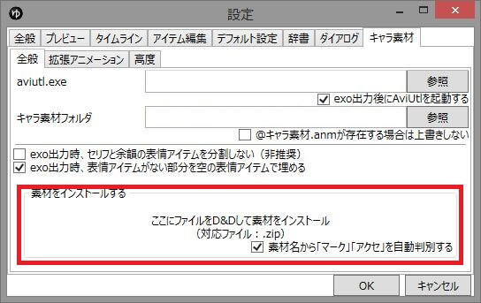
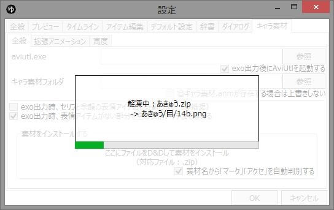
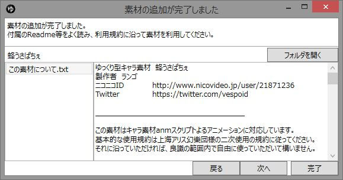
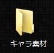

## キャラ素材のダウンロード
「[キャラ素材総合ページ – nicotalk&キャラ素材配布所](http://www.nicotalk.com/charasozai.html)」から、好みのキャラ素材をダウンロードします。

## キャラ素材の配置（自動）

ゆっくりMovieMaker v3.4.5.0以降では、ゆっくりMovieMaker側のキャラ素材インストール機能を使用して以前より簡単にキャラ素材を配置することが出来ます。  
ファイル(F)→設定(S)→キャラ素材タブ→全般タブ を開き、「素材をインストールする」と表記されている枠内にダウンロードした素材ファイルをD&Dします。

素材をドロップすると自動的に素材のインストールが開始されます。

インストール完了後、素材中に含まれる利用規約等と思われるtxtファイル/pdfファイル/htmlファイルがリストアップされます。  
規約をよく読み、同意した場合にのみ素材を使用してください。

## キャラ素材の配置（手動）
**手動でキャラ素材を配置する方法です。
現在は上記「キャラ素材の配置（自動）」の方法を使用し、自動的にキャラ素材を配置することが出来ます。**

キャラ素材をダウンロードし終わったら、まず「キャラ素材を保存するフォルダ」として「キャラ素材」フォルダを作成します。

保存した素材を解凍し、先ほど作成した「キャラ素材」フォルダの中にコピーします。

このとき、解凍した素材が2重フォルダになっていないかどうか、確認しておきます。
正しいフォルダ構造は、

- キャラ素材
    - キャラ素材名（「れいむ」等）
        - 顔
        - 後
        - 口
        - 全
        - 他
        - 体
        - 髪
        - 眉
        - 目
        - ※素材によっては存在しないフォルダもあります
    - キャラ素材名（「まりさ」等）
        - 顔
        - 後
        - ・
        - ・
        - ・

です。
使用してる解凍ソフトによっては、

- キャラ素材
    - キャラ素材名（「れいむ」等）
        - キャラ素材名（「れいむ」等）
            - 顔
            - 後
            - ・
            - ・
            - ・
    - キャラ素材名（「まりさ」等）
        - キャラ素材名（「まりさ」等）
            - 顔
            - 後
            - ・
            - ・
            - ・

このように2重にフォルダが生成されてしまう可能性があります。  
2重にフォルダが生成されていた場合は片方のフォルダを削除し、正常なフォルダ構成に直してください。

また、

- キャラ素材
    - キャラ
        - キャラ素材名（「れいむ」等）
        - キャラ素材名（「まりさ」等）
- 小道具
    - アクセサリ
    - マーク

のように、各キャラ素材を「キャラ」フォルダの中に配置してもキャラ素材を利用可能です。

## マーク・アクセサリの配置
キャラ素材と一緒に使用する事が可能なマーク・アクセサリをダウンロードした場合、以下のようにファイルを配置します。  
この時、ファイル名を01.png 02.png 03.png … となるようにリネームするのを忘れないでください。  
ただし、ファイル名に 01u.png等数字の後にアルファベットが付属していた場合、数字の部分のみを上手く連番になるようにリネームしてください。

- キャラ素材
    - キャラクター名1
    - キャラクター名2
    - **小道具**
        - **アクセサリ**
            - 01.png
            - 02.png
            - 02u.png
            - 03.png
            - 04.png
            - ・
            - ・
            - ・
        - **マーク**
            - 01.png
            - 02.png
            - ・
            - ・
            - ・
