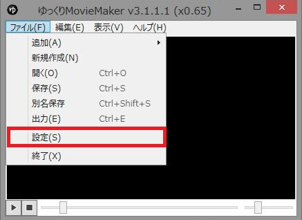
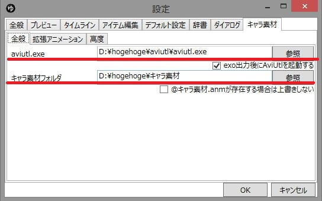

## 設定ウィンドウを開く

キャラ素材を利用するために、必要な情報をゆっくりMovieMakerに設定します。  
ゆっくりMovieMakerを起動し、メインメニュー上部メニューより、[設定ウィンドウ](../../help/settings/index.md)を表示してください。

## 各種パスをゆっくりMovieMakerに登録する

設定ウィンドウを開いたら「[キャラ素材](../../help/settings/h2013419141746382.md)」タブを表示し、

- [AviUtl/拡張編集プラグインのダウンロード](../install/h201341925739519.md)で保存したaivutl.exeのパス  
- [キャラ素材のダウンロード/配置](../charasozai/h201341942212331.md)で保存したキャラ素材のパス 
 
をそれぞれ設定してください。