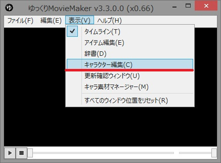
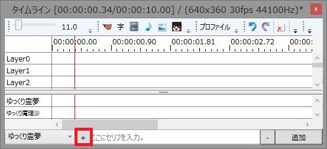
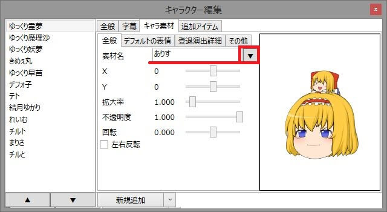

## キャラクター編集ウィンドウを開く

キャラ素材を利用するために、各キャラクターに使用する素材を設定します。  
メインウィンドウ上部メニューの「表示」から「キャラクター編集」にチェックを入れるか、タイムラインウィンドウ下部の「＋」ボタンを押し、[キャラクター編集ウィンドウ](/ymm3/help/charactereditor/)を表示してください。

## 素材名をキャラクターに設定する

キャラクター編集ウィンドウを表示後、左リストからキャラクターを選択し、[「キャラ素材」タブ](/ymm3/help/charactereditor/h2013419141614319/)→「全般」タブを表示します。  
素材名に[キャラ素材のダウンロード/配置](/ymm3/tutorial/charasozai/h201341942212331/)で配置した素材の素材名（フォルダ名）を指定してください。

また、入力欄右側の「▼」ボタンをクリックし、一覧から使用したい素材を選択することでも素材の指定が可能です。

以上でキャラ素材の設定は完了です。  
必要に応じて「拡大率」「X」「Y」の数値を調節してください。