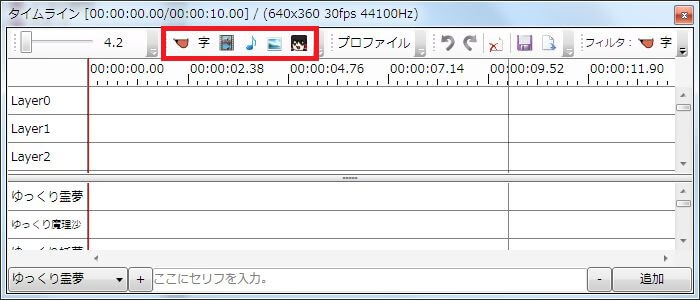
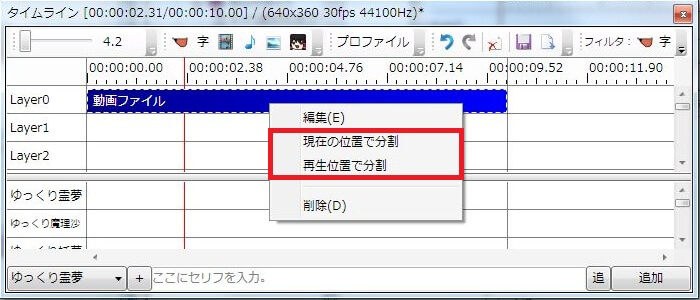
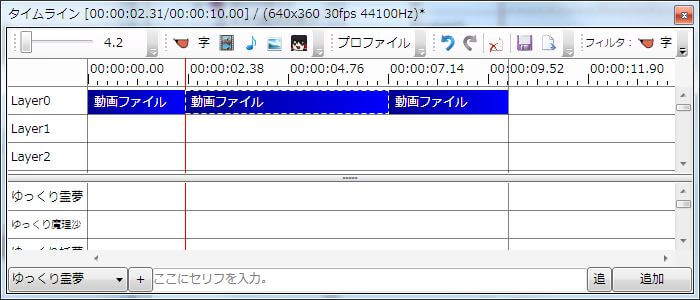
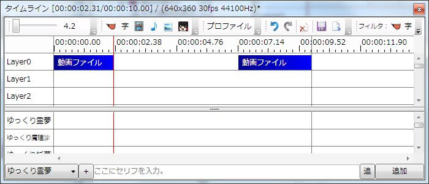
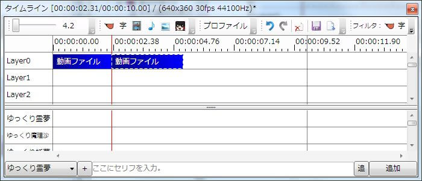
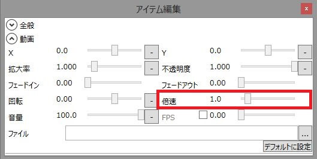
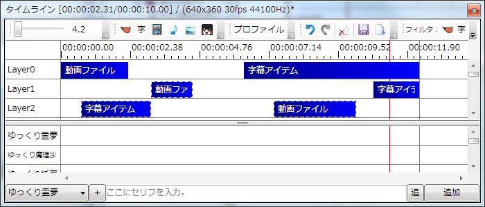
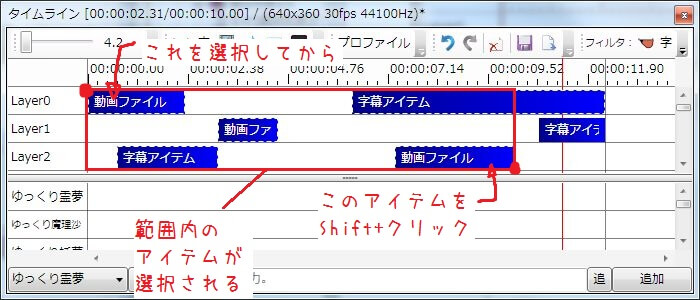

## アイテムを追加する
### ボタン/メニューから追加する

タイムラインウィンドウ上部メニューからアイテムを追加します。  
また、タイムラインを右クリックして表示されるメニューや、メインウィンドウ上部メニュー→ファイル→追加から表示されるメニューからも同様にアイテムを追加できます。  
ここからは

- ゆっくりボイス
- 字幕
- 動画ファイル
- 音声ファイル
- 画像ファイル
- 表情オブジェクト

が追加可能です。  
ファイル系アイテム追加時、「設定→タイムライン→アイテム追加時にファイル選択ダイアログを表示する」にチェックが入っているとファイル選択用のダイアログが表示されます。

### ファイルを直接追加する
タイムラインに直接動画/画像/音声ファイルをD&Dすると、アイテムを追加する事が出来ます。

### ゆっくりボイスの追加に関して
ゆっくりボイスの追加方法に関しては、「[ボイスを追加する](h201341985731491.md)」ページをご覧下さい。

## アイテムを編集する
### アイテム編集ウィンドウを表示する
アイテムをダブルクリックするか、アイテムを右クリック→編集をクリックするとアイテム編集ウィンドウが表示されます。  
アイテム編集ウィンドウを利用して、再生速度や拡大率等の変更が可能です。  
アイテム編集ウィンドウの数値に関しては「[アイテム編集](../../help/editor/index.md)」をご覧下さい。

### カット編集をする

動画をカット編集したい場合、アイテムを右クリックし「現在の位置で分割」もしくは「再生位置で分割」を選択し、アイテムを分割します。
- 現在の位置で分割：マウスを右クリックした部分で分割
- 再生位置で分割：プレビューの再生位置でアイテムを分割

カットした部分を切り出したら切り出したアイテムを選択し、Deleteキーを押せばアイテムが削除されます。

最後に、カットしたアイテムを左に詰めればカット編集は完了です。

### 倍速編集をする

カット編集の要領で、倍速したい部分を切り出します。

倍速したいアイテムの編集ウィンドウを開き、「倍速」の数値を変更すると倍速編集が出来ます。

### 複数のアイテムを選択し、移動させる
特定の操作をすると複数のアイテムを同時に選択する事が可能です。  
選択した複数のアイテムは、タイムライン上をまとめて移動させる事が可能です。

#### 複数のアイテムを選択 – Ctrl + クリック

Ctrlキーを押しながらアイテムをクリックすると、複数のアイテムをまとめて選択できます。

#### 複数のアイテムをまとめて選択 – Shift + クリック

アイテムを一つ選択した後、Shiftキーを押しながらもう一つのアイテムをクリックすると、二つのアイテムの範囲内に存在する全てのアイテムを選択できます。

#### 全てのアイテムを選択 – Ctrl+A
Ctrl+Aキーを押すと、タイムライン上の全てのアイテムを選択できます。