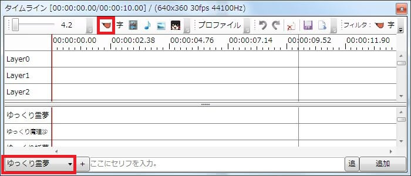
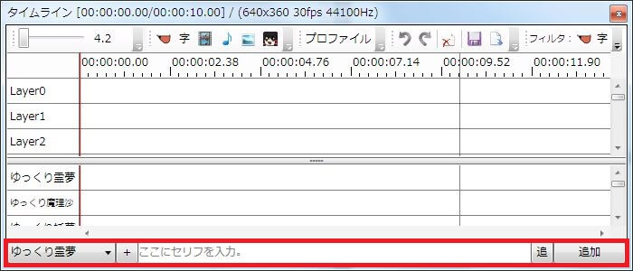

## ゆっくりボイスとその付属アイテム
ゆっくりMovieMakerにはゆっくりボイスと各種アイテムとの連携機能が充実しています。  
適切な設定を行う事で、ゆっくりボイスと一緒に各種アイテムの表示が可能です。  
連携機能の設定方法に関しては「[字幕/キャラ素材を連携させる](/ymm3/tutorial/editing/h201341985754115/)」の項目をご覧下さい。

## ボタンからボイスを追加する

ゆっくりボイス追加ボタンをクリックすると、現在の再生位置に「設定→デフォルト設定」の設定で、現在のキャラクターのゆっくりボイスが追加されます。

## タイムライン下部のゆっくりボイス追加エリアからボイスを追加する

タイムライン下部のゆっくりボイス追加エリアから直接セリフを入力する事も出来ます。  
キャラクターを選択後、「ここにセリフを入力」へセリフを入力し、Enterキーを押すか、「追加」ボタンを押すとタイムラインにゆっくりボイスが追加されます。  
また、この時Shift+Enterキーを押すと複数行のセリフを入力する事が出来ます。  

### TIPS
ゆっくりMovieMaker3からは、「ここにセリフを入力」と表示されているテキストボックスにフォーカスを移していない状態でも、キー入力をするだけで自動的にテキストボックスにフォーカスが移動するようになりました。

## カスタムボイスを利用する
ゆっくりMovieMakerが現在対応している音声合成エンジンは「Aquestalk」「Aquestalk2」「SAPI5対応エンジン」の3種のみです。  
これ以外の音声合成エンジンで出力した音声や、その他の音声素材をゆっくりボイスとして扱いたい場合、カスタムボイス機能を使用します。  
- [VOICEROID+を使用する](/ymm3/tips/yukkuri/h201342223491450/)

## その他
- [ボーカロイドに喋らせる](/ymm3/tips/yukkuri/h2013422234958360/)
- [UTAUに喋らせる](/ymm3/tips/yukkuri/h201422514303591/)