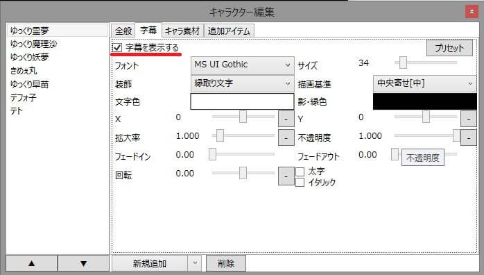
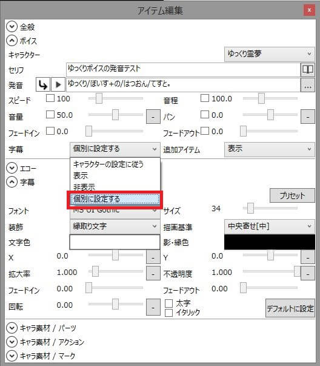
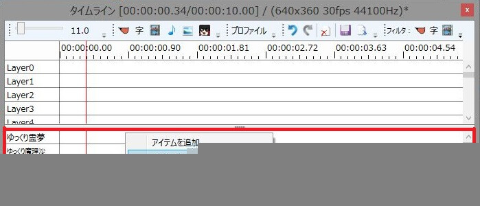
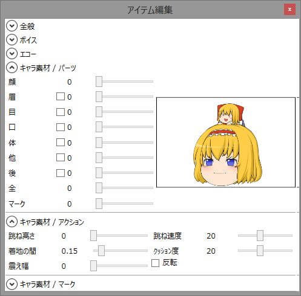
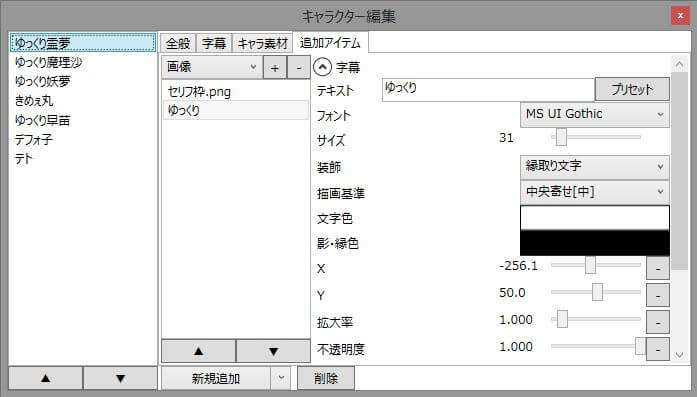
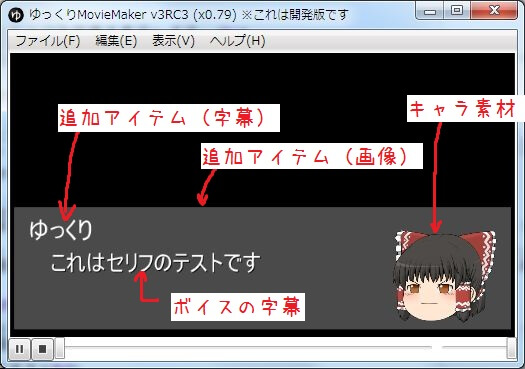

## 各種アイテムとの連携
ゆっくりMovieMakerに適切な設定をするだけで、字幕やキャラ素材等との連携が可能です。

## 字幕の連携
ゆっくりボイスと一緒にセリフの字幕を表示します。  
この字幕はゆっくりボイスの「セリフ」に入力されたテキストが表示されます。  
複数行の字幕を表示したい場合、ゆっくりボイスの「セリフ」欄でShift＋Enterキーを押してテキストを改行してください。

### キャラクターに字幕の設定をする

追加したアイテム全てに字幕を表示させたい場合、キャラクター毎に字幕の表示設定を行います。  
「キャラクター編集ウィンドウ→字幕→字幕を表示する」にチェックを入れるだけで字幕が表示されるようになります。

### ゆっくりボイス単体に字幕の設定をする

キャラクター毎の字幕設定の他に、ゆっくりボイス単体でも字幕の設定が可能です。  
ゆっくりボイスの「字幕」欄から「表示」を選択すると、キャラクター側で字幕の表示設定をしていなくても字幕が表示されます。  
「非表示」を選択すると、キャラクター側で字幕を表示する設定をしている場合でも字幕が表示されません。  
「個別に設定する」を選択すると、フォントや字幕サイズなど、ゆっくりボイス個別に設定する事が出来ます。

## キャラ素材との連携
動画にキャラ素材を表示している場合、ゆっくりボイスを追加するだけで自動的に口パクするようになります。  
また、ゆっくりボイス個別にキャラ素材の表情を指定する事も出来ます。

### 動画にキャラ素材を表示する
キャラ素材を表示するためには、事前にゆっくりMovieMakerとキャラクターに設定を行う必要があります。  
詳細は「[キャラ素材を使用する準備をする](/ymm3/tutorial/charasozai/)」のページをご覧下さい。

動画にキャラ素材を表示する場合、タイムライン下部のキャラ素材専用タイムラインを右クリックし、「アイテムを追加」「塗りつぶし」「現在の位置から塗りつぶし」「再生位置から塗りつぶし」のいずれかを選択し、キャラ素材ベースアイテムを追加します。  
キャラ素材ベースアイテムが存在している期間のみキャラ素材が表示されます。

### 表情を設定する

ゆっくりボイス毎に表情を設定したい場合、ゆっくりボイスを表示し、「キャラ素材/パーツ」から表情を設定してください。

### 追加アイテムを表示する

事前にキャラクタ?に設定する事で、ゆっくりボイスを再生時、任意の字幕/画像を自動的に表示する事が出来ます。

#### ゆっくりボイス＋字幕＋キャラ素材＋追加アイテム連携の一例
