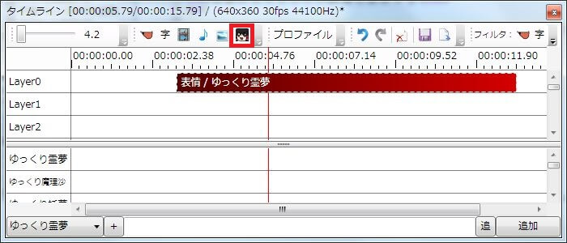

動画にキャラ素材を表示している場合、ゆっくりボイスを追加するだけで自動的に口パクするようになります。
また、ゆっくりボイス個別にキャラ素材の表情を指定する事も出来ます。

## 動画にキャラ素材を表示する
キャラ素材を表示するためには、事前にゆっくりMovieMakerとキャラクターに設定を行う必要があります。
詳細は「[キャラ素材を使用する準備をする](../charasozai/index.md)」のページをご覧下さい。

動画にキャラ素材を表示する場合、タイムライン下部のキャラ素材専用タイムラインを右クリックし、「アイテムを追加」「塗りつぶし」「現在の位置から塗りつぶし」「再生位置から塗りつぶし」のいずれかを選択し、キャラ素材ベースアイテムを追加します。  
キャラ素材ベースアイテムが存在している期間のみキャラ素材が表示されます。

## 表情を設定する

ゆっくりボイス毎に表情を設定したい場合、ゆっくりボイスを表示し、「キャラ素材/パーツ」から表情を設定してください。  
**※ キャラ素材が表示されていない状態で表情を変更してもキャラ素材は表示されません。**

## 任意のタイミングで表情を変更する

ゆっくりボイスを伴わない任意のタイミングで表情を変更したい場合、タイムラインに表情アイテムを追加します。  
**※ キャラ素材が表示されていない状態で表情を変更してもキャラ素材は表示されません。**