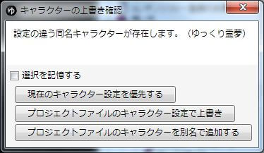

## プロジェクトを保存
メインウィンドウ上部メニューから「ファイル→プロジェクトの保存」をクリックするか、「Ctrl+S」を押すとプロジェクトファイル(.ymmp)が保存されます。

プロジェクトファイルは動画の編集状況を保存した物で、**.aviや.mp4のような動画ファイルではありません。**  
この状態ではニコニコ動画やYoutubeにアップロードできないのはもちろん、aviutlをはじめとする各種動画編集ソフトでも読み込めないので注意してください。  
**ニコニコ動画等動画投稿サイトへアップしたり、動画編集ソフトで読み込み可能なファイルを出力する方法に関しては、「[動画を出力する](/ymm3/tutorial/output/h2013419924477/)」のページをご覧下さい。 ** 

## プロジェクトを読み込む
「ファイル→プロジェクトを読み込む」もしくはプレビュー画面にプロジェクトファイル(.ymmp)をドラッグ＆ドロップする事で読み込む事が出来ます。  
この時、ゆっくりMovieMaker側のキャラクター設定とプロジェクト側のキャラクター設定が異なっていた場合、以下のダイアログが表示されます。

### 現在のキャラクター設定を優先する
プロジェクトファイルのキャラクターを、ソフト側のキャラクターの設定で上書きします。

### プロジェクトファイルのキャラクター設定で上書き
ソフト側のキャラクター設定を、プロジェクト側のキャラクター設定で上書きします。

### プロジェクトファイルのキャラクターを別名で追加する
ソフト側のキャラクターに、プロジェクト側のキャラクターを別名で追加します。

## プロジェクトがロードできなくなった場合
「ファイル(F)→バックアップから復元(B)」から、復元可能です。

## プロジェクト読み込みが終わらない場合
- [プロジェクトファイルの読み込みが完了しない](/ymm3/faq/editing/プロジェクトファイルの読み込みが完了しない/)