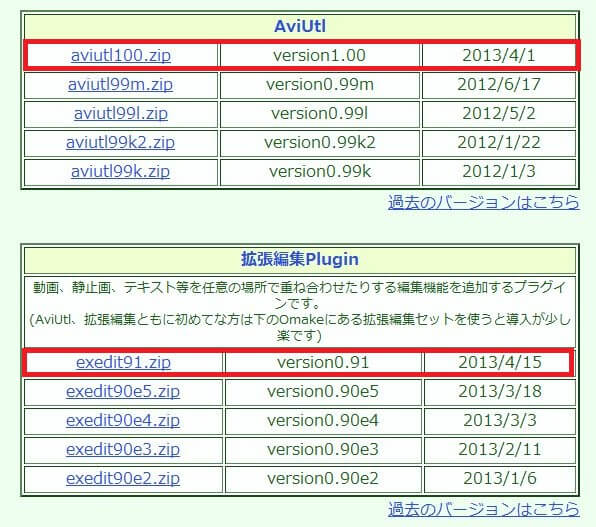
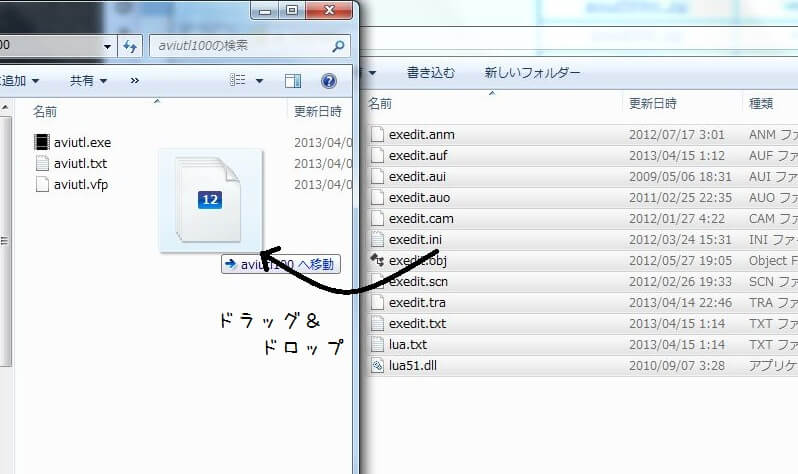
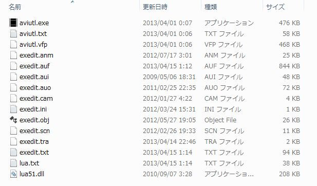

## AviUtlと拡張編集プラグインのダウンロード

[AviUtlのお部屋](http://spring-fragrance.mints.ne.jp/aviutl/)からAviUtlと拡張編集プラグインの2つをダウンロードします。  
この際、必ず**最新のバージョンをダウンロードしてください**。  
また、ページ下部の「omake」で「aviutl_plus」というAviUtlと拡張編集プラグインのセットが配布されていますが、バージョンが古く、ゆっくりMovieMakerが出力したファイルを正常に読み込めない可能性があるので使用しないでください。

## ファイルの配置

ダウンロードしてきたファイルを展開し、拡張編集プラグインをAviUtlフォルダにコピーします。

拡張編集プラグインを導入後はこのようなファイル配置になります。