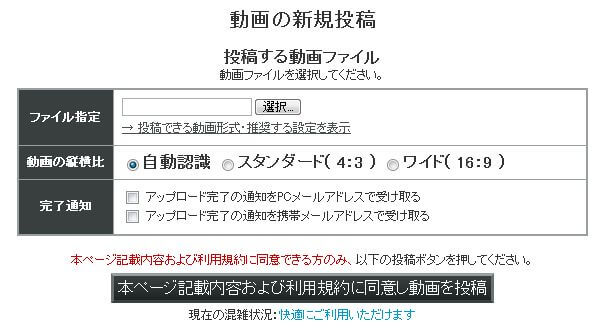

[ニコニコ動画](https://www.nicovideo.jp)にログインし、上部メニューから「[動画を投稿](http://www.upload.nicovideo.jp/upload)」をクリックし、動画投稿ページに移動します。

「ファイル指定」の項目で、作成した動画ファイルを選択し、ニコニコ動画の規約をよく読んでから「本ページ記載内容および利用規約に同意し動画を投稿」ボタンをクリックします。  
しばらくすると動画のアップロードが完了し、動画情報を入力するページへ移動します。  
必要事項を入力し、「この内容で登録」ボタンを押せば動画の投稿が完了します。  

ゆっくりMovieMakerを使用して作成した動画をニコニコ動画に投稿する際は、以下のページを参考にしてコンテンツツリーへの登録をお願いします。  
- [コンテンツツリーに登録する](/ymm3/tutorial/output/h20134199232488/)  
また、Youtube等その他の動画投稿サイトへ動画を投稿する場合は、キャプションやクレジットにゆっくりMovieMakerを使用したという旨の記載して頂けると助かります。