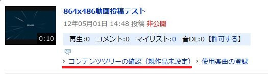
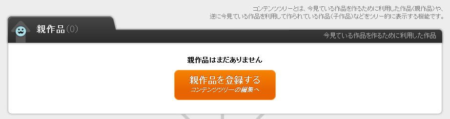
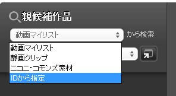

ゆっくりMovieMakerを使用して作成した動画をニコニコ動画に投稿する場合、
「[ゆっくり実況がすごく簡単に作れるようになった【ゆっくりMovieMaker3】](http://www.nicovideo.jp/watch/sm20953272)」
を親作品に登録するようお願いします。

## マイページに移動し、投稿動画ページからコンテンツツリー登録ページへ移動する

ニコニコ動画の[マイページ](http://www.nicovideo.jp/my/)から、[動画投稿ページ](http://www.nicovideo.jp/my/video)へ移動し、ゆっくりMovieMakerを利用して作成した動画を探します。
動画情報下部の「コンテンツツリーの確認（親作品未登録）」をクリックし、コンテンツツリーの登録ページへ移動してください。

ページ上部の「親作品を登録する コンテンツツリーの編集へ」ボタンをクリックし、コンテンツツリーの編集画面へ移動してください。

「親候補作品」下部のコンボボックスをクリックし、「IDから指定」を入力します。  
動画IDを入力するエリアが表示されるので、作品IDに「**sm20953272**」と入力し、「＋」ボタンを押してください。  
候補に「ゆっくり実況がすごく簡単に作れるようになった【ゆっくりMovieMaker3】」が表示されるので、「親作品」欄にアイテムをドラッグし、「この内容でコンテンツツリーを作成する」をクリックすると設定が完了します。

以上で「ソフトの導入」～「動画の出力・動画の投稿」の全ての家庭が完了しました。お疲れ様です。