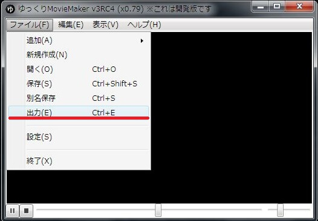
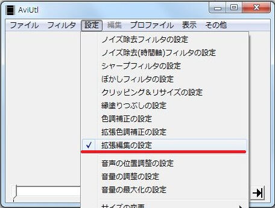
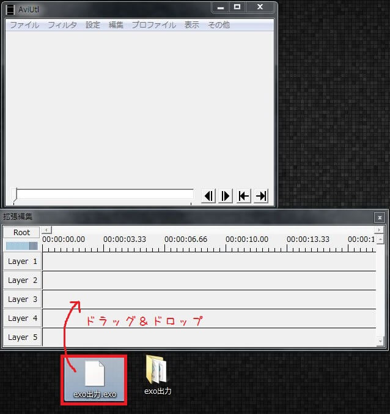

## 1. exoファイルを出力する

「メニュー→出力」をクリックし、ゆっくりMovieMakerで作成したプロジェクトをAviUtlで読み込み可能な形式で出力します。

### キャラ素材を使用する場合
キャラ素材を使用していてゆっくりMovieMakerにaviutlのパスを設定していない場合、「[キャラ素材を使用する準備をする](../charasozai/index.md)」の項目を参考に設定を行ってください。

## 2. AviUtlに読み込む
拡張編集プラグインを導入したAviUtlを起動します。  
導入が済んでいない場合、「[AviUtl/拡張編集プラグインのダウンロード](../install/h201341925739519.md)」を参考に、導入を行ってください。

AviUtlを起動後、メニューから「表示→拡張編集の設定」にチェックを入れ、拡張編集ウィンドウを表示します。

拡張編集ウィンドウが表示されたら、「1，exoファイルを出力する」で出力したexoファイルを拡張編集ウィンドウにドラッグ＆ドロップします。  
exoファイルを読み込んだ際、動画の画面サイズが正常に表示されていない場合、「[画面サイズがゆっくりMovieMakerで指定したサイズと異なっている](../../faq/aviutl/h2013419142026315.md)」のページをご覧下さい。

## 3. 追加の編集をする
AviUtl側で、ゆっくりMovieMakerでは出来なかった編集作業（フィルタ効果・高度なアニメーション等）を行います。  
AviUtlでの編集時に役立つTIPSを「[TIPS/AviUtl関連](../../tips/aviutl/index.md)」に。  
AviUtlでのトラブルに関するよくある質問を「[よくある質問/AviUtl関連](../../faq/aviutl/index.md)」にまとめてあるので、こちらもあわせてご覧下さい。

## 4. 動画を出力する
「ファイル→Avi出力」もしくは「ファイル→プラグイン出力」から、ニコニコ動画等動画投稿サイトに投稿可能な動画ファイルを出力します。  
また、高画質で動画を投稿したい場合、別途h264プラグインを導入する必要があります。  
詳細は「[オススメのエンコ設定は？](../../faq/aviutl/h2013419142054660.md)」のページをご覧下さい。

## 5. 動画を確認する
動画投稿前に必ず一度編集ミスがないかどうかのチェックを行いましょう。  
誤字脱字誤読、カットや倍速ミス、エフェクトのかけ忘れ等、思わぬミスが見つかる場合があります。