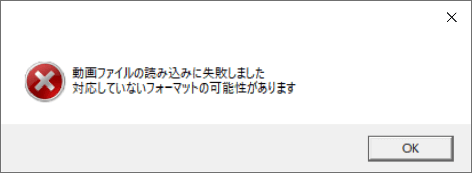

## 発生する症状

> 動画ファイルの読み込みに失敗しました
> 対応していないフォーマットの可能性があります

と表示される

## 原因
動画の読み込みに必要なプラグインをAviUtlに導入していない

## 対策
使用したい動画に応じてプラグインを導入する必要があります

### L-SMASH Works File Reader / .mp4 .mkv .mp3 等
AviUtlにL-SMASH Works File Readerプラグインを導入する必要があります。
- [AviUtlにL-SMASH Worksをインストールする](/ymm4/faq/動画出力/AviUtl経由で動画を出力する/#l-smash-works)