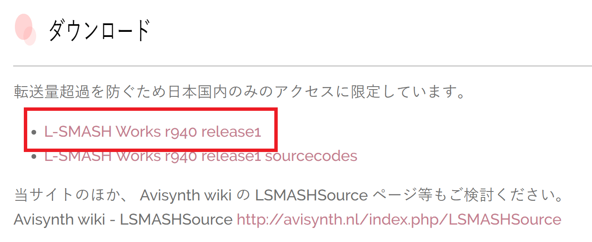
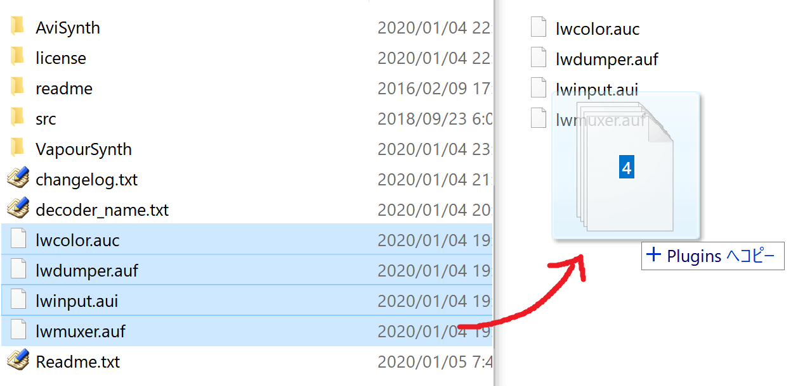
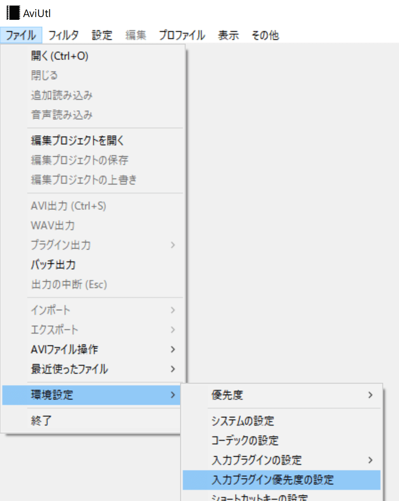
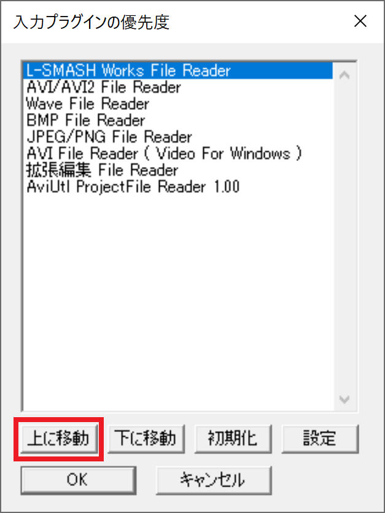

## 発生する症状

> 動画ファイルの読み込みに失敗しました
> 対応していないフォーマットの可能性があります

と表示される

## 原因
動画の読み込みに必要なプラグインをAviUtlに導入していない

## 対策
使用したい動画に応じてプラグインを導入する必要があります

### L-SMASH Works File Reader / .mp4 .mkv .mp3 等
1. RePOPnへアクセスし、ファイルをダウンロードする

1. AviUtlフォルダ内に「Plugins」フォルダを作成する

1. ダウンロードしたファイルを開き、「Plugins」フォルダ内に「lwcolor.auc」「lwdumper.auf」「lwinput.aui」「lwmuxer.auf」の4ファイルをコピーする

1. AviUtlを起動する
1. ファイル → 環境設定 → 入力プラグインの優先度の設定 を開く

1. L-SMASH Works File Reader の優先度を一番上に設定する

1. OKボタンをクリックする
