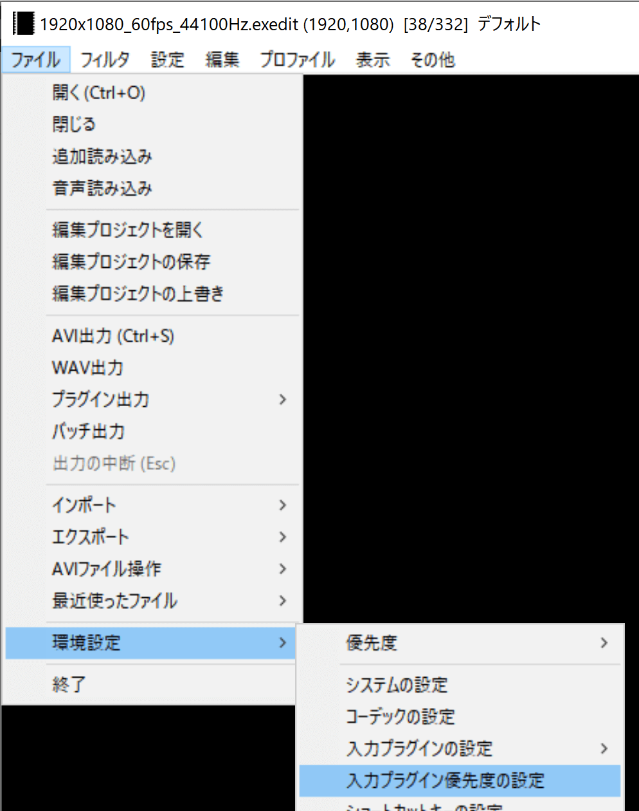
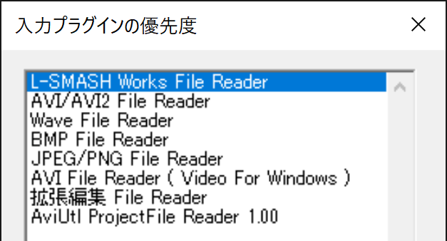
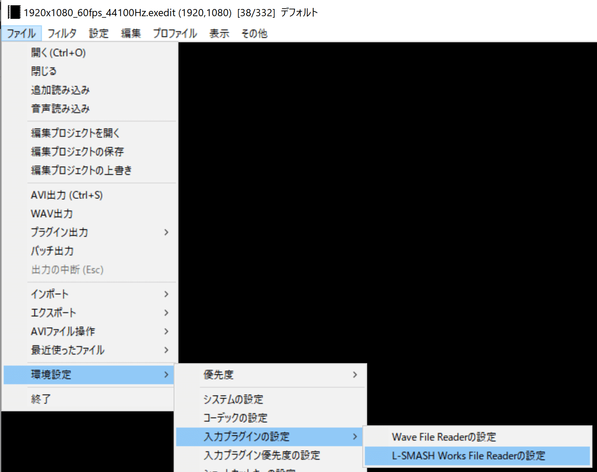
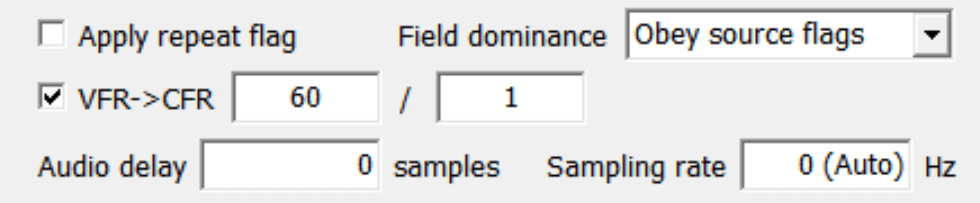
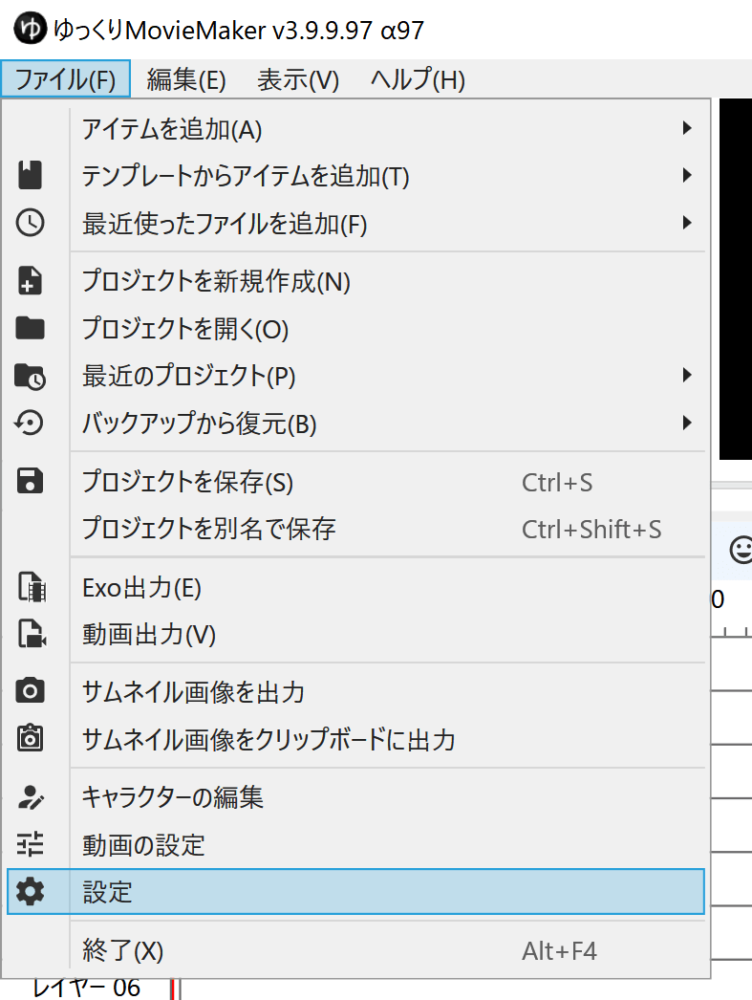
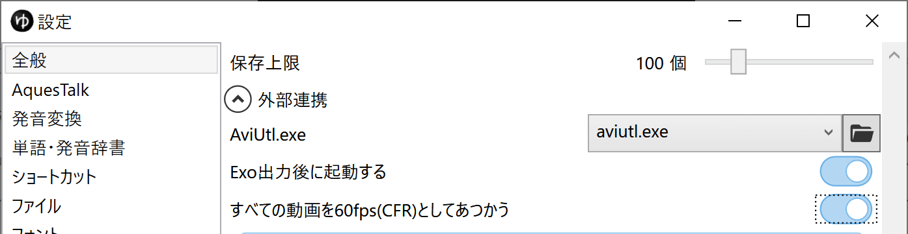

## 発生する症状
カット編集を行った動画の再生開始位置がズレる。
YMM4で指定した再生開始位置とAviUtlで表示される再生位置が異なる。

## 原因
VFR（可変フレームレート）動画を使用している。

## 対策
1. AviUtlに「L-SMASH Works File Reader」を導入する
1. AviUtlを起動する
1. ファイル → 環境設定 → 入力プラグインの優先度の設定 を開く

1. L-SMASH Works File Reader の優先度を一番高く設定する

1. OKボタンをクリックする
1. ファイル → 環境設定 → 入力プラグインの設定 → L-SMASH Works File Readerの設定 を開く

1. VFR->CFR にチェックを入れ、右側の入力欄に 60 / 1 を指定する

1. OKボタンをクリックする
1. AviUtlを閉じる
1. YMM4を起動する
1. ファイル(F) → 設定 を開く

1. 全般 → 外部連携 → すべての動画を60fps(CFR)としてあつかう を有効にする

1. Exo出力する